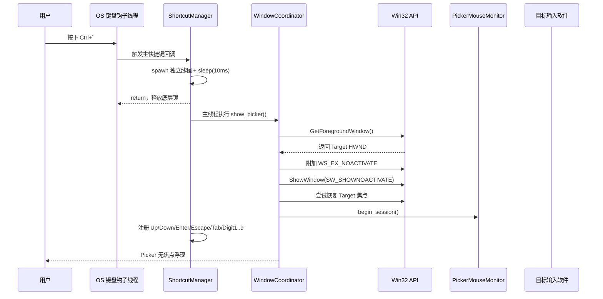
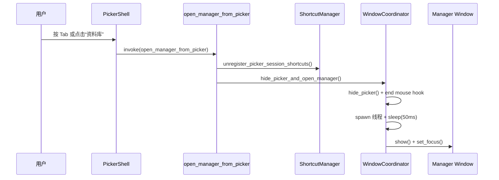
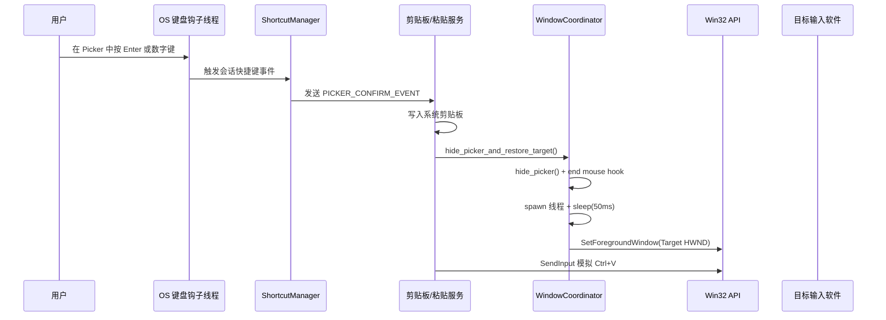

# 无焦点速贴窗口架构与防坑指南

## 1. 架构概述

FloatPaste 的“速贴窗口”（Picker）需要在用户按下全局快捷键（如 `Ctrl+\``）时瞬间呼出，并且**尽量不抢占当前正在工作的目标软件（如 Word、代码编辑器）的输入焦点**。用户在 Picker 中可以使用会话快捷键（`Up / Down / Enter / Escape / Tab / 1-9`）、双击条目，或直接点击窗口外部结束本次速贴会话。

当前实现已经形成五条关键链路：

1. **预创建独立窗口壳层**：`tauri.conf.json` 预创建隐藏的 `picker` 窗口，前端依据窗口标签渲染 `PickerShell`。
2. **智能定位策略**：根据设置优先贴近鼠标、上次关闭位置或目标窗口插入符位置，并在超出工作区时自动回收至可见区域。
3. **Win32 无焦点显示**：通过 `WS_EX_NOACTIVATE` 与 `ShowWindow(SW_SHOWNOACTIVATE)` 避免抢占焦点，并在必要时立即恢复目标窗口。
4. **会话期快捷键调度**：动态注册 Picker 会话快捷键，避免主快捷键与会话控制相互冲突，并支持方向键长按连续导航。
5. **会话退出兜底**：通过鼠标低级钩子监听窗口外点击，并提供 `Tab` 切回资料库窗口的链路。

---

## 2. 核心实现逻辑与时序图

### 2.1 呼出速贴窗口（Show Picker）

1. **记录当前活动窗口**：在显示 Picker 前，若当前不是从 Manager 进入，则通过 `GetForegroundWindow` 记录目标窗口句柄（HWND）。
2. **解析显示位置**：根据 `pickerPositionMode` 计算窗口左上角坐标；`caret` 模式优先读取目标线程插入符位置，失败时回退到鼠标位置，`lastPosition` 模式则复用上次关闭时保存的位置。
3. **无焦点显示**：调用 Windows API 给 Picker 打上 `WS_EX_NOACTIVATE` 扩展样式，并通过 `ShowWindow(SW_SHOWNOACTIVATE)` 显示窗口。
4. **保险式恢复焦点**：若存在目标窗口句柄，则在显示后立即尝试一次 `SetForegroundWindow(HWND)`，把焦点拉回原目标窗口。
5. **注册会话快捷键**：动态注册 `Up / Down / Enter / Escape / Tab / Digit1..Digit9`，接管本次速贴会话的键盘操作；按住方向键时，会进入后台重复发射导航事件。
6. **启动鼠标外点监控**：注册 `WH_MOUSE_LL` 低级鼠标钩子，检测用户是否点在 Picker 外部。
7. **必要时隐藏 Manager**：如果本次是从资料库进入 Picker，则隐藏 Manager，只保留 Picker 作为当前可见主界面。

### 2.2 从 Picker 切回资料库（Open Manager From Picker）

1. **触发入口**：用户在 Picker 中按下 `Tab`，或点击顶部“资料库”按钮。
2. **Rust 侧统一收口**：前端调用 `open_manager_from_picker`，由 Rust 统一完成会话清理，避免前端先后调用多个命令造成竞态。
3. **先结束 Picker 会话**：注销会话快捷键，停止鼠标外点监控，并隐藏 Picker。
4. **延迟打开 Manager**：后台线程休眠 `50ms`，等待 WebView2 与窗口管理器完成本次隐藏，再回到主线程 `show + focus` Manager。

### 2.3 确认粘贴与关闭窗口（Hide & Paste）

1. **卸载会话能力**：取消注册 `Up / Down / Enter / Escape / Tab / Digit1..Digit9`，并关闭鼠标钩子。
2. **持久化当前位置**：在窗口仍可读取几何信息时，先保存当前左上角坐标，供 `lastPosition` 模式下次复用。
3. **隐藏 Picker**：通过 Tauri API 隐藏速贴窗口。
4. **延迟恢复目标**：休眠 `50ms`，等待窗口隐藏稳定后，再根据会话来源恢复目标应用或重新打开 Manager。
5. **模拟粘贴**：粘贴服务写入系统剪贴板，并利用 `SendInput` 模拟 `Ctrl+V`。

### 2.4 前端窗口壳层与桥接

1. `src/app/App.tsx` 会通过 `src/bridge/window.ts` 读取当前 `WebviewWindow` 标签。
2. 当前标签为 `picker` 时渲染 `PickerShell`，否则渲染 `ManagerShell`。
3. `src/bridge/commands.ts` 负责把 `show_picker_from_manager`、`hide_picker`、`open_manager_from_picker` 等命令封装成前端可调用接口。
4. `ManagerShell` 在桌面运行时监听 `Escape` 并隐藏当前窗口；`PickerShell` 则负责按钮点击、读取设置中的速贴记录数，并在浏览器预览模式下提供本地按键 fallback。

---

## 3. 踩坑记录与解决方案（Troubleshooting）

### 坑位一：WebView2 冷启动时叠加 Win32 干预，容易白屏或只剩边框

- **现象**：在动态创建窗口后立即修改无焦点样式，WebView2 可能只显示透明边框，内容区未正确渲染。
- **原因**：窗口创建、React 页面加载、Win32 样式修改都堆叠在冷启动阶段，容易打断 WebView2 的初始化时序。
- **解决方案**：在 `tauri.conf.json` 中预创建隐藏的 `picker` 窗口，运行时优先走显示/隐藏切换；`ensure_picker_window()` 只保留为异常情况下的兜底重建路径。

### 坑位二：全局快捷键 Hook 线程重入死锁

- **现象**：第一次唤起 Picker 正常，第二次按主快捷键或 `Escape` 关闭时应用卡死。
- **原因**：
  1. `global-shortcut` 插件在回调执行期间持有底层注册表锁。
  2. 回调内如果立刻进入主线程注销快捷键，会和当前未释放的锁形成互相等待。
- **解决方案**：把关闭逻辑剥离到独立线程，先 `sleep(10ms)` 让原回调尽快返回，再由主线程执行窗口切换与注销操作。

### 坑位三：隐藏 Picker 后立即恢复焦点，容易触发窗口竞态

- **现象**：关闭 Picker 后，偶发目标窗口没有恢复到最前，或者 Manager 没有稳定拿到焦点。
- **原因**：`hide()`、WebView2 隐藏动画、`SetForegroundWindow()`、`show()` 都发生在同一帧时，Windows 窗口管理器容易出现状态竞争。
- **解决方案**：在 `hide_picker()` 后统一走后台线程 `sleep(50ms)`，再执行恢复目标窗口或打开 Manager。

### 坑位四：无焦点窗口不会天然感知“点击窗口外部”

- **现象**：Picker 不抢焦点后，单靠前端 `blur`、`focusout`、文档点击事件，无法可靠判断用户是不是点到了窗口外部。
- **原因**：这些事件只能覆盖 WebView 内部，无法覆盖整个桌面坐标系，也无法判断非客户区或别的应用窗口上的点击。
- **解决方案**：增加 `picker_mouse_monitor.rs`，使用 `WH_MOUSE_LL` 捕获鼠标按下事件，结合 `GetWindowRect` 判断点击点是否落在 Picker 边界外；若落在外部，则异步关闭 Picker 并恢复目标窗口。

### 坑位五：从 Picker 返回 Manager 时，前端串联多个命令容易造成清理顺序不一致

- **现象**：如果前端先 `hide_picker()` 再 `open_manager()`，会出现会话快捷键未及时释放、鼠标钩子未统一关闭，或窗口切换时序不一致的问题。
- **原因**：前端拆成多个 IPC 命令后，清理逻辑分散在不同调用点，容易遗漏共享状态收口。
- **解决方案**：新增 `open_manager_from_picker` 命令，把“释放会话快捷键 -> 结束鼠标监控 -> 隐藏 Picker -> 延迟打开 Manager”统一放到 Rust 侧执行。

### 坑位六：插入符定位不是所有应用都稳定可读

- **现象**：在部分浏览器、管理员权限窗口或自绘输入框中，Picker 无法稳定贴到文本光标附近。
- **原因**：`GetGUIThreadInfo` 只能在目标线程暴露可用插入符时返回有效坐标；部分应用不会公开该信息，或当前前台线程已经切换。
- **解决方案**：`caret` 模式下优先尝试读取插入符；失败时自动回退到鼠标位置。若用户需要稳定可预期的位置，可改用 `mouse` 或 `lastPosition` 模式。

### 坑位七：透明窗口圆角穿帮（背景遮挡与外阴影裁切）

- **现象**：在桌面环境下，Picker 窗口四周出现明显直角（常见为背景色或黑色尖角），看起来与圆角壳层冲突。
- **原因**：
  1. `html/body` 存在不透明背景色，会遮挡 Tauri 透明窗口壳层，导致圆角区域被实色填充。
  2. 修复为合法阴影语法后，外阴影会真实生效；但 Picker 是 `transparent(true) + decorations(false) + shadow(false)` 的矩形原生窗口，超出窗口边界的外阴影会被系统裁切，四角最明显。
- **关键结论**：圆角“变尖”并不一定是圆角本身失效，常见是“背景遮挡”或“外阴影裁切”两类问题叠加。
- **解决方案**：
  1. 强制 `html.window-picker, html.window-picker body, html.window-picker #root` 完全透明，避免背景遮挡圆角。
  2. Picker 外壳禁用外阴影（`shadow-none` / `dark:shadow-none`），保留 `rounded + border + ring-inset`。
  3. 如需层次感，优先使用内阴影（inset）；若必须使用外阴影，需要在窗口几何层预留安全边距并同步评估定位与最小尺寸。
- **快速排查**：
  1. 先确认构建产物中 `shadow-[...]` 是否被正确编译，判断阴影是否真实生效。
  2. 临时切换 `shadow-none`，若尖角立即消失，可定位为外阴影裁切。
  3. 结合 `window_coordinator.rs` 的窗口配置（`transparent`、`decorations`、`shadow`）交叉验证。
---

## 4. 当前落地文件（截至 2026-03-15）

与本篇文档直接对应的核心文件如下：

- `src-tauri/src/services/window_coordinator.rs`
- `src-tauri/src/services/shortcut_manager.rs`
- `src-tauri/src/services/picker_position_service.rs`
- `src-tauri/src/commands/windows.rs`
- `src-tauri/src/platform/windows/picker_mouse_monitor.rs`
- `src-tauri/src/platform/windows/picker_position.rs`
- `src-tauri/src/platform/windows/active_app.rs`
- `src-tauri/src/platform/windows/window_utils.rs`
- `src-tauri/src/repository/sqlite_repository.rs`
- `src/bridge/commands.ts`
- `src/bridge/window.ts`
- `src/app/App.tsx`
- `src/features/manager/ManagerShell.tsx`
- `src/features/picker/PickerShell.tsx`

