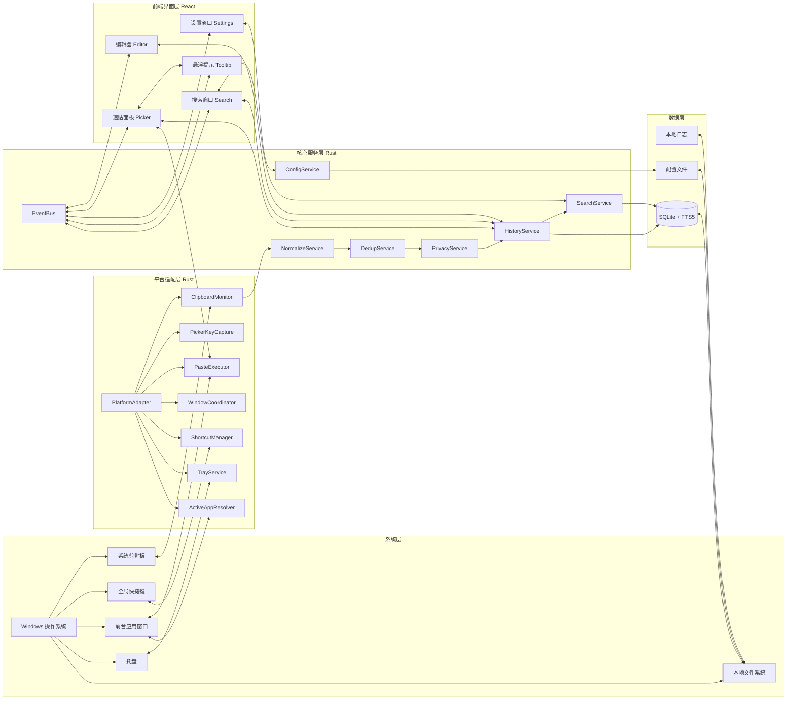
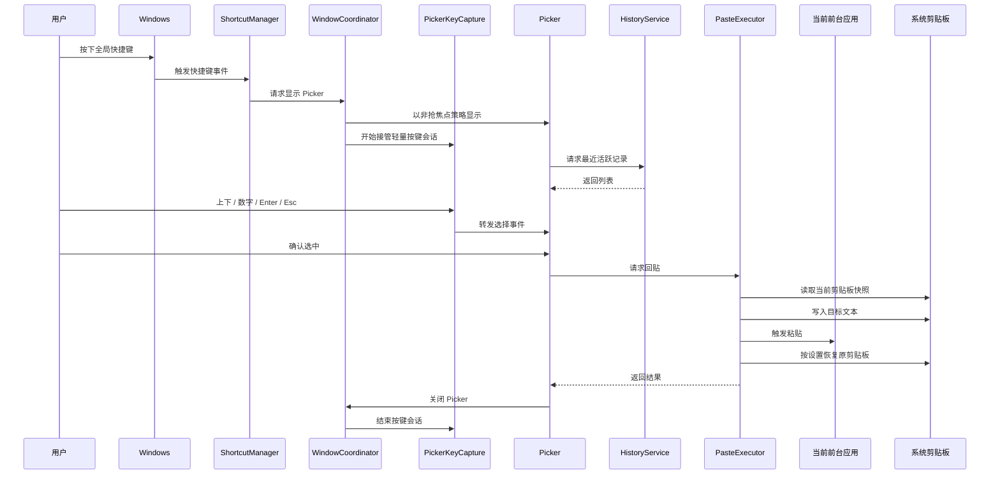
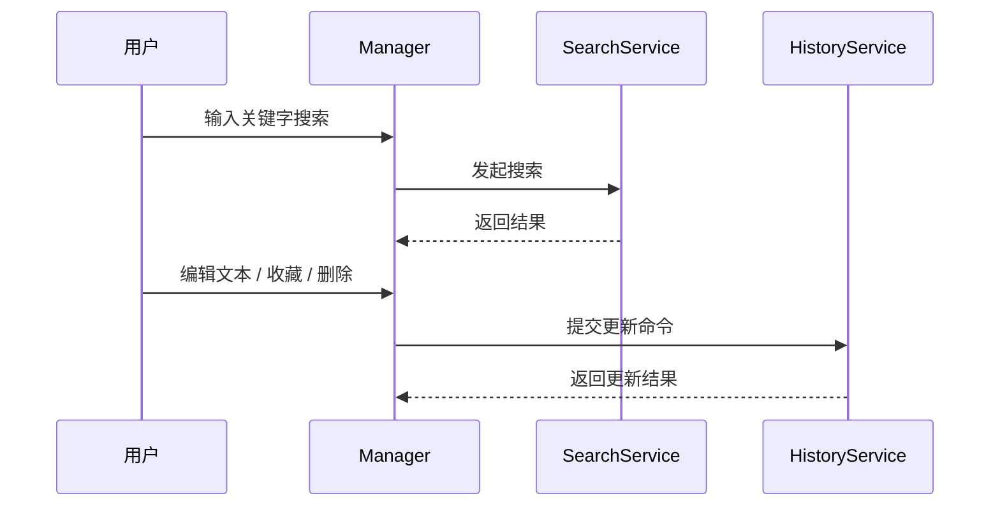

# FloatPaste / 浮贴 架构设计与 MVP 技术方案

## 1. 文档目标

本文档用于将 FloatPaste 的产品形态与技术选型收敛为一版可执行、可排期、可开发的正式方案。

本文档的目标是同时满足两件事：

1. 保留完整、清晰、适合评审的文档结构。
2. 将 MVP 范围收缩到真正可落地、低风险、可验证核心价值的实现边界。

本文档是“合并后的最终稿”，用于替代此前偏“产品目标版”的设计稿与偏“工程约束版”的设计说明。

---

## 2. 核心结论

### 2.1 产品定位

FloatPaste 是一个 **Windows 桌面剪贴板工具**，核心价值不是“保存很多剪贴内容”，而是：

- 持续记录剪贴历史
- 通过全局快捷键快速唤起速贴面板
- 在 **尽量不打断当前工作窗口** 的前提下，快速选择并重新粘贴历史内容
- 提供一个有焦点的资料库窗口，用于搜索、编辑、删除和收藏内容

### 2.2 首版产品形态

首版产品采用三段式结构：

- **后台常驻服务**：负责监听剪贴板、注册快捷键、管理托盘、执行回贴
- **速贴面板（Picker）**：高频入口，轻交互，尽量不抢焦点
- **资料库窗口（Manager）**：低频管理窗口，允许获取焦点

### 2.3 首版平台策略

**首发平台只支持 Windows。**

原因：

- “尽量不抢焦点”的体验是产品核心卖点，必须优先保证稳定性
- 回贴链路、窗口行为、托盘行为、全局快捷键在 Windows 上更适合形成稳定基线
- macOS 与 Linux 的焦点/注入/桌面环境差异先不进入首版范围

macOS 与 Linux 的支持保留在后续版本规划中，不纳入当前 MVP 的交付承诺。

### 2.4 已交付范围

当前版本（v0.2.x）已实现：

- **Windows**
- **文本剪贴项**（MVP）
- **图片剪贴项**（缩略图预览、悬浮大图、粘贴为文件路径）
- **文件剪贴项**（文件路径入库、文件数量/大小记录）
- **最近记录 / 收藏 / 删除 / 文本编辑 / 重新粘贴**
- **托盘、快捷键、排除应用、暂停监听**
- **主题定制**（浅色/深色/跟随系统 + 自定义颜色）
- **全局搜索窗口**（独立快捷键唤起、类型筛选、分页）
- **Tooltip 独立窗口**（鼠标悬停预览、屏幕边缘自适应定位）

以下能力未进入当前版本：

- 标签系统
- 云同步
- OCR
- AI 分类
- macOS / Linux 正式支持

---

## 3. 设计原则

### 3.1 不抢焦点优先于功能完备

首版最重要的设计原则不是“功能尽可能全”，而是：

**速贴面板的唤起、选择、粘贴这条核心链路，要尽量不打断当前工作上下文。**

因此：

- Picker 只承载轻交互
- Picker 不承担复杂编辑
- Picker 不承担完整搜索输入体验
- 深度搜索、文本编辑、批量管理一律进入 Manager 窗口

### 3.2 管理界面与速贴界面分离

- **Picker**：只做快速选择与回贴
- **Manager**：做完整搜索、编辑、删除、收藏、设置

### 3.3 本地优先

- 所有数据默认存储在本机
- 不向外部服务发送剪贴内容
- 所有历史、索引、配置、日志均保留本地

### 3.4 平台特化

虽然整体框架使用跨平台技术栈，但首版只做 Windows，因此涉及以下能力时允许使用 Windows 特化实现：

- 剪贴板监听
- 键盘输入捕获
- 当前前台窗口恢复/回贴
- 无焦点速贴面板交互

### 3.5 范围克制

MVP 的目标不是覆盖所有剪贴板数据类型，而是打穿一条稳定链路：

**复制文本 -> 自动入库 -> 快捷键唤起 -> 键盘选择 -> 重新粘贴成功**

---

## 4. 技术选型结论

### 4.1 技术栈

- 桌面容器：Tauri 2
- 系统核心：Rust
- 前端框架：React + Vite
- 样式方案：Tailwind CSS
- 前端状态：Zustand
- 数据获取：TanStack Query
- 本地数据库：SQLite
- 搜索方案：SQLite FTS5
- 日志：Rust tracing
- 配置：SQLite + JSON 配置文件

### 4.2 选型理由

- Tauri 2 适合轻量桌面常驻工具，前端与系统能力边界清晰。
- Rust 适合承接托盘、快捷键、剪贴板监听、平台适配和回贴执行。
- React 适合快速实现现代化界面与明确的组件边界。
- SQLite 足以承载本地持久化、全文搜索和后续迁移。

### 4.3 技术选型原则

- 前端不直接访问数据库
- 所有系统能力均在 Rust 层完成
- 所有平台相关能力统一收敛到 PlatformAdapter
- 所有数据库读写统一收敛到 Repository / Service 层

---

## 5. 总体架构

### 5.1 总体架构图



### 5.2 核心交互时序图

#### 5.2.1 速贴主链路



#### 5.2.2 管理窗口链路



---

## 6. 界面与职责分离

### 6.1 Picker（速贴面板）

职责：

- 展示最近活跃记录（文本、图片缩略图、文件摘要）
- 提供轻量预览（Tooltip 悬浮窗口显示图片大图或文本预览）
- 支持上下移动、数字直选、回车确认、Esc 关闭
- 支持收藏快捷键（Ctrl+Space）直接在 Picker 中切换收藏状态
- 图片条目支持 Shift+Enter 粘贴为文件路径
- 触发回贴
- 支持窗口宽度拖拽调整

不负责：

- 复杂文本输入
- 长列表全量搜索
- 文本编辑
- 标签管理
- 批量操作

#### 重要约束

**Picker 不提供自由文本搜索框**。

原因：

- 自由输入会显著增加焦点管理复杂度
- 中文输入法会放大”不抢焦点”实现成本
- 深度搜索通过全局搜索窗口独立提供

因此 Picker 的信息架构为：

- 最近活跃记录
- 快捷键提示

### 6.2 Search（搜索窗口）

职责：

- 完整历史浏览与全文搜索
- 类型筛选（全部 / 文本 / 图片 / 文件 / 收藏）
- 图片 Tooltip 预览与内联展开
- 调用编辑器窗口编辑文本
- 收藏 / 取消收藏
- 删除

Search 是一个正常获取焦点的桌面窗口，通过全局快捷键独立唤起。

### 6.3 Editor（编辑器窗口）

职责：

- 文本编辑
- 保存修改

Editor 从 Picker 或 Search 窗口唤出，编辑完成后返回来源窗口。

### 6.4 Settings（设置窗口）

职责：

- 快捷键配置（Picker 快捷键、搜索窗口快捷键）
- 通用设置（历史上限、速贴记录数）
- 外观设置（主题模式、自定义颜色、速贴位置模式）
- 行为设置（开机自启、静默启动、恢复剪贴板）
- 排除应用管理

Settings 是一个正常获取焦点的桌面窗口，通过托盘菜单或快捷方式打开。

### 6.5 Tooltip（悬浮提示窗口）

职责：

- 鼠标悬停时显示条目预览（图片大图或文本摘要）
- 屏幕边缘自适应定位
- 主题同步

Tooltip 是一个轻量级独立 WebviewWindow，不会抢占焦点，跟随鼠标位置动态显示。

### 6.6 托盘

职责：

- 常驻入口
- 打开搜索窗口 / 速贴面板
- 暂停 / 恢复监听
- 打开设置
- 退出

---

## 7. 分层说明

### 7.1 前端界面层

前端仅负责：

- 展示状态
- 呈现列表与预览
- 管理交互流程
- 调用 Tauri IPC 命令
- 响应事件总线通知

前端不直接负责：

- 剪贴板监听
- 快捷键注册
- 粘贴注入
- 数据库访问

### 7.2 核心服务层

核心服务层负责业务规则与状态组织。

- `HistoryService`：剪贴记录的创建、更新、删除、收藏与读取
- `SearchService`：FTS5 检索、排序、过滤（含类型筛选）
- `NormalizeService`：归一化文本内容、提取预览、生成哈希
- `DedupService`：基于哈希的短时间去重与历史记录刷新
- `PrivacyService`：排除应用、暂停监听、自写回抑制
- `ConfigService`：维护配置与运行期设置（含主题配置）
- `ImageStorage`：图片存储、PNG 编解码、文件管理
- `EventBus`：向前端广播状态变化

### 7.3 平台适配层

平台适配层只做 Windows 适配，是首版稳定性的关键。

- `ClipboardMonitor`：监听系统剪贴板变化（文本 + 图片 + 文件）
- `ImageClipboard`：图片剪贴板数据读取与写入（PNG 直传、DIB 格式转换）
- `FileClipboard`：文件剪贴板数据读取
- `PickerKeyCapture`：在 Picker 显示期间接管轻量按键输入
- `PasteExecutor`：将选中记录回贴到当前前台应用
- `WindowCoordinator`：控制 Picker / Search / Editor / Settings / Tooltip 窗口的显示隐藏与焦点策略
- `TooltipWindow`：管理 Tooltip 独立窗口的创建、定位与显示
- `ShortcutManager`：注册和更新全局快捷键（Picker + Search）
- `TrayService`：托盘菜单与运行状态切换
- `ActiveAppResolver`：识别当前前台应用，供排除策略使用
- `PlatformAdapter`：统一抽象 Windows 原生能力

### 7.4 数据层

- SQLite：记录、FTS 索引、收藏状态、配置快照
- 配置文件：基础运行配置与兼容性参数
- 本地日志：错误诊断和问题追踪

---

## 8. 模块拆分

| 模块 | 主要职责 | 输入 | 输出 | 依赖 |
| --- | --- | --- | --- | --- |
| Picker | 最近活跃记录展示（文本/图片/文件）、轻量选择、Tooltip 预览、触发回贴 | 快捷键事件、按键会话、列表数据 | 粘贴命令、关闭命令、编辑器唤起 | HistoryService、PasteExecutor、TooltipWindow |
| Search | 全文搜索、类型筛选、收藏管理、编辑器唤起 | 用户输入、编辑动作、筛选条件 | 更新命令、搜索结果 | HistoryService、SearchService |
| Editor | 文本编辑与保存 | 条目 ID、原始文本 | 更新命令 | HistoryService |
| Settings | 快捷键、外观、行为、排除应用等配置 | 用户输入 | 设置变更命令 | ConfigService |
| Tooltip | 鼠标悬停预览（图片大图/文本摘要） | 鼠标位置、条目数据 | 显示/隐藏窗口 | WindowCoordinator |
| Tray UI | 托盘入口、暂停监听、打开搜索/设置 | 托盘点击 | 状态切换、窗口命令 | TrayService、ConfigService |
| ClipboardMonitor | 监听剪贴板变化（文本/图片/文件） | Windows 剪贴板事件 | 原始剪贴板候选 | PlatformAdapter |
| NormalizeService | 文本归一化与预览生成 | 原始剪贴板内容 | 标准化文本项 | ClipboardMonitor |
| ImageStorage | 图片存储与编解码 | 剪贴板图片数据 | PNG 文件路径、尺寸、哈希 | ClipboardMonitor |
| DedupService | 去重 | 标准化条目 | 允许写入 / 刷新已有记录 / 拒绝写入 | NormalizeService |
| PrivacyService | 排除应用、自写回过滤、暂停监听 | 标准化条目、前台应用、配置 | 允许写入 / 拒绝写入 | ConfigService、ActiveAppResolver |
| HistoryService | 记录增删改查与收藏 | 新剪贴项、编辑命令 | 列表、详情、事件 | SQLite |
| SearchService | 全文检索、排序、过滤 | 查询词、筛选条件（含类型过滤） | 搜索结果 | SQLite FTS5 |
| PasteExecutor | 回贴选中项（文本粘贴/图片粘贴为文件路径） | itemId、回贴选项（pasteToTarget、asFile） | 回贴结果 | PlatformAdapter |
| ShortcutManager | 全局快捷键注册与更新（Picker + Search） | 设置变更 | 快捷键事件 | Windows API |
| WindowCoordinator | 管理 Picker/Search/Editor/Settings/Tooltip 窗口行为 | 显示/隐藏请求 | UI 状态变化 | Tauri Window |
| PlatformAdapter | 屏蔽 Windows 原生 API 细节 | 系统调用请求 | 能力结果 | Windows 实现 |

---

## 9. 关键能力设计

### 9.1 剪贴监听

当前版本支持三种剪贴板数据类型：

**文本**：
- 保存原始文本、预览文本、搜索文本
- 保存来源应用信息
- 保存创建时间、最近使用时间、收藏状态

**图片**：
- 监听剪贴板图片数据（支持 PNG 直传和 DIB 标准格式）
- 生成缩略图用于列表预览
- 保存为本地 PNG 文件，记录尺寸和文件大小
- 哈希去重（基于图片像素内容）

**文件**：
- 监听剪贴板文件列表
- 记录文件路径列表、文件数、目录数、总大小

监听策略：

- 对 8 秒窗口内的重复内容直接跳过
- 对历史上已存在的同 hash 内容刷新既有记录时间，而不是重复插入
- 支持排除应用名单
- 支持暂停监听
- 支持对”程序自己写回 clipboard”的情况做抑制，避免回贴后再次入库

### 9.2 搜索与排序

#### Picker 的排序策略

Picker 首版不做全文搜索，只做：

- 最近活跃优先
- 未使用过的记录以创建时间作为最近活跃时间

#### Manager 的搜索策略

Manager 支持全文搜索，排序优先级：

- 最近活跃优先
- 文本内容匹配优先
- 来源应用与时间过滤次之

当前实现补充：

- 前端输入采用 `250ms` 防抖，减少高频 IPC 与 FTS 查询抖动
- 默认按 `50` 条一页请求搜索结果，通过 `offset + limit` 翻页

#### 搜索协议约定

为避免前后端并行实现时出现协议歧义，首版将搜索协议固定如下：

```ts
type ClipType = "text" | "image" | "file";
type SearchSort = "relevance_desc" | "recent_desc";

interface SearchFilters {
  favoritedOnly?: boolean;
  clipType?: ClipType | null;
  sourceApp?: string | null;
  includeDeleted?: false;
}

interface SearchQuery {
  keyword: string;
  filters: SearchFilters;
  offset: number;
  limit: number;
  sort: SearchSort;
}

interface SearchResultItem {
  id: string;
  type: ClipType;
  contentPreview: string;
  tooltipText?: string | null;
  sourceApp: string | null;
  isFavorited: boolean;
  fileCount: number;
  directoryCount: number;
  createdAt: string;
  updatedAt: string;
  lastUsedAt: string | null;
  imagePath?: string | null;
  imageWidth?: number | null;
  imageHeight?: number | null;
  imageFormat?: string | null;
  fileSize?: number | null;
}

interface SearchResult {
  items: SearchResultItem[];
  total: number;
  offset: number;
  limit: number;
}
```

首版默认规则：

- `keyword` 允许为空字符串
- 当 `keyword` 为空时，`sort` 强制按 `recent_desc`
- 当 `keyword` 非空时，默认按 `relevance_desc`
- `filters.favoritedOnly` 默认 `false`
- `filters.clipType` 默认 `null`（不过滤类型），可设为 `"text"` / `"image"` / `"file"`
- `filters.sourceApp` 默认 `null`
- `filters.includeDeleted` 固定为 `false`，前端不暴露该选项
- `limit` 默认 `50`，最大 `100`
- `offset` 默认 `0`

排序落地规则：

- `recent_desc`：按 `COALESCE(last_used_at, created_at) DESC`，若相同再按 `created_at DESC`
- `relevance_desc`：先按 `FTS5 bm25 ASC`，再按 `COALESCE(last_used_at, created_at) DESC`，最后按 `created_at DESC`
- 收藏状态保留为独立属性与筛选条件，不参与默认历史排序，也不在 Picker 中单独置顶

### 9.3 回贴执行

回贴链路遵循以下原则：

- Picker 负责”选择”，不负责系统粘贴细节
- PasteExecutor 负责将目标内容写入系统剪贴板
  - 文本条目：写入文本，触发 Ctrl+V
  - 图片条目（Enter）：写入图片数据到剪贴板，触发 Ctrl+V
  - 图片条目（Shift+Enter）：将图片文件路径写入剪贴板，触发 Ctrl+V（粘贴为文件路径）
- PasteExecutor 负责触发系统粘贴动作
- 可选恢复此前的剪贴板内容
- 回贴失败必须返回明确错误码

PasteOption 扩展：

```rust
struct PasteOption {
    restore_clipboard_after_paste: bool,
    paste_to_target: bool,   // 是否注入到目标窗口
    as_file: bool,           // 图片条目是否粘贴为文件路径
}
```

### 9.4 焦点与窗口策略

首版明确区分两类界面：

- **Picker**：尽量不抢前台工作窗口焦点，强调快速选择与回贴
- **Manager**：正常获取焦点，用于管理和编辑

窗口策略原则：

- Picker 只承载轻交互，不承载复杂输入
- Picker 采用“从创建开始即按无焦点窗口设计”的策略
- 不在首版承诺 Picker 内自由文本输入
- Windows 是唯一首发平台，不引入跨平台窗口行为妥协

---

## 10. 核心接口草案

### 10.1 Rust 服务接口

```rust
trait ClipboardMonitor {
    fn start(&self) -> Result<(), AppError>;
    fn stop(&self) -> Result<(), AppError>;
    fn is_running(&self) -> bool;
}

trait HistoryRepository {
    fn save_item(&self, item: ClipItem) -> Result<ClipItem, AppError>;
    fn list_recent(&self, limit: u32) -> Result<Vec<ClipItem>, AppError>;
    fn list_favorites(&self, limit: u32) -> Result<Vec<ClipItem>, AppError>;
    fn get_detail(&self, id: String) -> Result<ClipItemDetail, AppError>;
    fn delete_item(&self, id: String) -> Result<(), AppError>;
    fn update_text(&self, id: String, text: String) -> Result<ClipItem, AppError>;
    fn set_favorited(&self, id: String, value: bool) -> Result<(), AppError>;
    fn mark_used(&self, id: String) -> Result<(), AppError>;
}

trait SearchService {
    fn search(&self, query: SearchQuery) -> Result<SearchResult, AppError>;
}

trait PasteExecutor {
    fn paste_item(&self, item_id: String, option: PasteOption) -> Result<PasteResult, AppError>;
}

trait PlatformAdapter {
    fn register_shortcut(&self, shortcut: String) -> Result<(), AppError>;
    fn show_picker(&self) -> Result<(), AppError>;
    fn hide_picker(&self) -> Result<(), AppError>;
    fn begin_picker_key_session(&self) -> Result<(), AppError>;
    fn end_picker_key_session(&self) -> Result<(), AppError>;
    fn current_foreground_app(&self) -> Result<Option<AppIdentity>, AppError>;
    fn snapshot_clipboard_text(&self) -> Result<ClipboardSnapshot, AppError>;
    fn write_clipboard_text(&self, text: String) -> Result<(), AppError>;
    fn write_clipboard_image(&self, image_data: &[u8]) -> Result<(), AppError>;
    fn restore_clipboard_text(&self, snapshot: ClipboardSnapshot) -> Result<(), AppError>;
    fn trigger_paste(&self) -> Result<(), AppError>;
}
```

补充类型约定：

```rust
enum ClipType {
    Text,
    Image,
    File,
}

struct ClipboardSnapshot {
    text: Option<String>,
}

enum SearchSort {
    RelevanceDesc,
    RecentDesc,
}

struct SearchQuery {
    keyword: String,
    filters: SearchFilters,
    offset: u32,
    limit: u32,
    sort: SearchSort,
}

struct SearchFilters {
    favorited_only: Option<bool>,
    clip_type: Option<ClipType>,
    source_app: Option<String>,
    include_deleted: Option<bool>,
}

struct SearchResult {
    items: Vec<ClipItemSummary>,
    total: u32,
    offset: u32,
    limit: u32,
}

struct ClipItemSummary {
    id: String,
    r#type: String,
    content_preview: String,
    tooltip_text: Option<String>,
    source_app: Option<String>,
    is_favorited: bool,
    file_count: i32,
    directory_count: i32,
    created_at: String,
    updated_at: String,
    last_used_at: Option<String>,
    image_path: Option<String>,
    image_width: Option<i32>,
    image_height: Option<i32>,
    image_format: Option<String>,
    file_size: Option<i64>,
}

struct ClipItemDetail {
    id: String,
    r#type: String,
    content_preview: String,
    full_text: String,
    search_text: String,
    source_app: Option<String>,
    is_favorited: bool,
    created_at: String,
    updated_at: String,
    last_used_at: Option<String>,
    hash: String,
    image_path: Option<String>,
    image_width: Option<i32>,
    image_height: Option<i32>,
    image_format: Option<String>,
    file_size: Option<i64>,
    file_paths: Vec<String>,
    file_count: i32,
    directory_count: i32,
    total_size: Option<i64>,
}

struct PasteOption {
    restore_clipboard_after_paste: bool,
    paste_to_target: bool,
    as_file: bool,
}

struct PasteResult {
    success: bool,
    code: String,
    message: String,
}
```

回贴流程约束：

1. `PasteExecutor` 先调用 `snapshot_clipboard_text()`
2. 再写入目标文本并触发粘贴
3. 如果 `restoreClipboardAfterPaste = true`，则在短延迟后调用 `restore_clipboard_text(snapshot)`
4. `PrivacyService` 必须在恢复阶段和目标写入阶段都应用自写回抑制，避免两次重复入库
5. 首版 `ClipboardSnapshot` 只处理文本；未来若支持图片或文件，再扩展为枚举结构

### 10.2 Tauri IPC 命令边界

前端与 Rust 的命令边界统一收敛为：

**剪贴项操作**
- `list_recent_items(limit)`
- `list_favorite_items(limit)`
- `get_item_detail(id)`
- `search_items(query)`
- `update_text_item(id, text)`
- `delete_item(id)`
- `set_item_favorited(id, value)`
- `paste_item(id, option)`

**窗口管理**
- `show_picker()`
- `hide_picker()`
- `open_settings()`
- `open_editor_from_picker(item_id)`
- `open_editor_from_search(item_id)`
- `hide_editor()`
- `open_search_global()`
- `hide_search()`
- `prepare_search_window_drag()`

**Tooltip**
- `show_tooltip(request_id, x, y, html, theme, theme_vars)`
- `tooltip_ready(request_id, width, height)`
- `hide_tooltip()`

**设置**
- `get_settings()`
- `update_settings(payload)`
- `pause_monitoring()`
- `resume_monitoring()`

---

## 11. 数据模型草案

### 11.1 核心实体

```ts
type ClipType = "text" | "image" | "file";

interface ClipItemSummary {
  id: string;
  type: ClipType;
  contentPreview: string;
  tooltipText?: string | null;
  sourceApp: string | null;
  isFavorited: boolean;
  fileCount: number;
  directoryCount: number;
  createdAt: string;
  updatedAt: string;
  lastUsedAt: string | null;
  // 图片特有
  imagePath?: string | null;
  imageWidth?: number | null;
  imageHeight?: number | null;
  imageFormat?: string | null;
  fileSize?: number | null;
}

interface ClipItemDetail {
  id: string;
  type: ClipType;
  contentPreview: string;
  fullText: string;
  searchText: string;
  sourceApp: string | null;
  isFavorited: boolean;
  createdAt: string;
  updatedAt: string;
  lastUsedAt: string | null;
  hash: string;
  // 图片特有
  imagePath?: string | null;
  imageWidth?: number | null;
  imageHeight?: number | null;
  imageFormat?: string | null;
  fileSize?: number | null;
  // 文件特有
  filePaths: string[];
  fileCount: number;
  directoryCount: number;
  totalSize?: number | null;
}

interface UserSetting {
  shortcut: string;
  searchShortcut: string;
  searchShortcutEnabled: boolean;
  launchOnStartup: boolean;
  silentOnStartup: boolean;
  historyLimit: number;
  pickerRecordLimit: number;
  pickerPositionMode: "mouse" | "lastPosition" | "caret";
  themeMode: "system" | "light" | "dark";
  customThemeColors: {
    light: { windowBg: string; cardBg: string; accent: string };
    dark: { windowBg: string; cardBg: string; accent: string };
  };
  excludedApps: string[];
  restoreClipboardAfterPaste: boolean;
  pauseMonitoring: boolean;
}
```

### 11.2 SQLite 表结构

当前表结构：

- `clip_items`
- `clip_items_fts`
- `excluded_apps`
- `settings`

#### `clip_items`

| 字段 | 类型 | 说明 |
| --- | --- | --- |
| id | TEXT PK | 记录 ID |
| type | TEXT | 条目类型：text / image / file |
| full_text | TEXT | 原始全文（文本条目） |
| preview_text | TEXT | 列表预览 |
| search_text | TEXT | 搜索文本 |
| source_app | TEXT NULL | 来源应用 |
| is_favorited | INTEGER | 是否收藏 |
| hash | TEXT | 去重哈希 |
| image_path | TEXT NULL | 图片存储路径 |
| image_width | INTEGER NULL | 图片宽度 |
| image_height | INTEGER NULL | 图片高度 |
| image_format | TEXT NULL | 图片格式（png） |
| file_size | INTEGER NULL | 文件大小（字节） |
| file_paths | TEXT NULL | 文件路径列表（JSON 数组） |
| file_count | INTEGER | 文件数量 |
| directory_count | INTEGER | 目录数量 |
| total_size | INTEGER NULL | 文件总大小 |
| created_at | INTEGER | 创建时间 |
| updated_at | INTEGER | 更新时间 |
| last_used_at | INTEGER NULL | 最近使用时间 |
| deleted_at | INTEGER NULL | 软删除时间 |

#### `clip_items_fts`

用于全文搜索，索引字段：

- `full_text`
- `search_text`
- `source_app`

### 11.3 存储策略

- 文本直接存储在 SQLite
- 图片以 PNG 格式存储在应用数据目录下的 `images/` 子目录中
- 文件条目仅记录路径引用，不复制文件内容
- 删除采用软删除，后续可定期清理

---

## 12. Windows 首发策略

### 12.1 首发范围

首发平台：

- Windows 10
- Windows 11

### 12.2 支持能力

| 能力 | Windows 首发要求 |
| --- | --- |
| 全局快捷键 | 强支持 |
| 无焦点 Picker | 强支持，作为核心体验目标 |
| 剪贴板监听 | 强支持 |
| 回贴执行 | 强支持 |
| 托盘常驻 | 强支持 |
| 文本搜索 | 强支持 |

### 12.3 后续平台规划

后续版本可考虑：

- macOS：作为第二平台评估
- Linux：在桌面环境差异可接受时进入实验支持

但这些内容不进入当前版本范围，也不写入当前交付承诺。

---

## 13. 已实现功能范围

### 13.1 已实现

- 文本剪贴项记录
- 图片剪贴项记录（缩略图预览、悬浮大图、粘贴为文件路径）
- 文件剪贴项记录（路径入库、文件数量/大小记录）
- 最近记录列表
- 收藏 / 取消收藏（Picker 内 Ctrl+Space 快捷键）
- 删除记录
- 文本编辑（独立编辑器窗口）
- 搜索窗口全文搜索 + 类型筛选
- 速贴面板快捷键唤起
- 方向键 / 数字键 / Enter / Esc 完成速贴闭环
- 选中项快速回贴（文本/图片/图片文件路径）
- Tooltip 悬浮预览窗口
- 主题定制（浅色/深色/跟随系统 + 自定义颜色）
- 托盘菜单
- 基础设置
- 排除应用名单
- 暂停监听
- 本地日志与基础错误提示

### 13.2 未实现

- Picker 内自由文本搜索
- 标签系统
- OCR
- 富文本结构化编辑
- 云同步
- 团队共享
- AI 分类 / 摘要
- 多设备同步
- macOS / Linux 支持

---

## 14. 非功能要求

- Picker 唤起需体感即时
- 最近 1000 条文本记录的 Manager 搜索需保持流畅
- 后台常驻进程不应长期占用异常 CPU
- 数据默认本地存储，不上传外部服务
- 快捷键唤起失败、回贴失败、监听失败应有可诊断日志
- 搜索接口默认分页参数应保证单次查询不超过 100 条

---

## 15. 风险与降级策略

### 15.1 焦点行为问题

风险：

- 无焦点 Picker 的真实行为可能受窗口创建顺序、输入法、系统前台窗口状态影响

策略：

- Picker 从创建开始即按无焦点窗口设计
- 首版不在 Picker 中支持自由输入
- 所有轻量选择按键由平台层接管

### 15.2 回贴稳定性问题

风险：

- 不同前台应用对粘贴注入的响应存在差异

策略：

- 所有回贴逻辑统一封装在 PasteExecutor
- 失败时给出错误码与日志
- 提供“恢复原剪贴板”开关

### 15.3 隐私与敏感内容

风险：

- 密码管理器、终端、远程桌面、隐私场景不适合被记录

策略：

- 提供排除应用名单
- 提供暂停监听
- 后续再评估敏感应用预设

### 15.4 范围膨胀

风险：

- 若首版同时引入图片、文件、跨平台支持，会显著稀释核心链路打磨质量

策略：

- 明确锁定 Windows + Text only MVP
- 其他能力在 v1.1 / v1.2 再逐步引入

---

## 16. 验收场景

### 16.1 功能验收

- 复制一段文本后能够自动入库
- 资料库中能够搜索到该文本
- 资料库中可编辑文本并保存
- 收藏状态可切换，且收藏项可在资料库收藏区独立查看
- 删除记录后，列表与搜索结果同步消失
- 选中历史项后能够重新粘贴到当前应用

### 16.2 交互验收

- 全局快捷键能够稳定唤起 Picker
- Picker 可通过方向键、数字键、回车、Esc 完成完整操作
- Picker 唤起和关闭不应明显打断前台工作流
- Manager 可正常获取焦点并进行搜索和编辑
- 托盘菜单可切换监听状态并打开资料库

### 16.3 Windows 平台验收

- 在 Windows 10 / 11 上可完成监听、搜索、回贴、托盘基础链路
- 常见桌面应用中速贴闭环可用
- 快捷键冲突或注册失败时可被感知并记录

---

## 17. 实施顺序建议

### Phase 1：后台核心闭环

- 完成 SQLite 模型
- 完成 ClipboardMonitor
- 完成 Normalize / Dedup / Privacy 链路
- 完成 HistoryService
- 完成 SearchQuery / SearchResult 协议与 FTS 查询实现
- 完成基本日志

### Phase 2：资料库窗口

- 完成 Manager 列表与详情
- 完成全文搜索
- 完成编辑 / 删除 / 收藏
- 完成设置基础项

### Phase 3：速贴主链路

- 完成 PickerWindow
- 完成 WindowCoordinator
- 完成 ShortcutManager
- 完成 PickerKeyCapture
- 完成 PasteExecutor
- 打通无焦点速贴闭环

### Phase 4：收口与稳定性

- 托盘菜单
- 排除应用
- 暂停监听
- 快捷键冲突提示
- 恢复原剪贴板
- 错误提示与日志完善

---

## 18. 当前目录结构

```text
floatpaste/
  src/
    app/
      App.tsx
      queryClient.ts
    bridge/
      commands.ts
      events.ts
      runtime.ts
      window.ts
      imageUrl.ts
      mockBackend.ts
    features/
      picker/
        PickerShell.tsx
        queries.ts
        favoriteToggle.ts
        tooltipHtml.ts
        tooltipState.ts
        previewLayout.ts
      search/
        SearchShell.tsx
        queries.ts
        state.ts
        store.ts
        keyboard.ts
        filterKeyboard.ts
        favoritedState.ts
        itemPointer.ts
      editor/
        EditorShell.tsx
        store.ts
        keyboard.ts
      settings/
        SettingsShell.tsx
        SettingsNav.tsx
        SettingsSection.tsx
        settingsSections.ts
        useSettingsNavigation.ts
        queries.ts
      workbench/
        state.ts
        keyboard.ts
    shared/
      ui/
        Panel.tsx
        StatusBadge.tsx
        LoadingSpinner.tsx
        WindowResizeHandles.tsx
        tooltipConfig.ts
      utils/
        time.ts
        clipDisplay.ts
        error.ts
      types/
        settings.ts
        clips.ts
      queries/
        clipQueries.ts
      theme.ts
      themeColors.ts
  src-tauri/
    src/
      main.rs
      lib.rs
      app_bootstrap.rs
      launch_mode.rs
      commands/
        clips.rs
        settings.rs
        windows.rs
      services/
        history_service.rs
        search_service.rs
        normalize_service.rs
        dedup_service.rs
        privacy_service.rs
        paste_executor.rs
        shortcut_manager.rs
        tray_service.rs
        window_coordinator.rs
        tooltip_window.rs
        image_storage.rs
        picker_position_service.rs
        settings_service.rs
        startup_service.rs
      repository/
        sqlite_repository.rs
      domain/
        clip_item.rs
        settings.rs
        events.rs
        error.rs
        editor_session.rs
        search_session.rs
      platform/
        windows/
          clipboard_monitor.rs
          picker_mouse_monitor.rs
          picker_position.rs
          active_app.rs
          shortcuts.rs
          tray.rs
          window_utils.rs
          single_instance.rs
          startup.rs
          image_clipboard.rs
          file_clipboard.rs
          paste_executor.rs
      migrations/
        0001_init.sql
      capabilities/
        background.json
        picker.json
        search.json
        editor.json
        settings.json
        tooltip.json
      tauri.conf.json
```

---

## 19. 最终决策摘要

首版最终决策如下：

- 框架：Tauri 2
- 前端：React + TypeScript + Tailwind
- 核心：Rust
- 存储：SQLite + FTS5
- 平台：**Windows only**
- 数据类型：**Text only**
- 产品形态：后台常驻 + 无焦点 Picker + 有焦点 Manager
- 核心卖点：**不打断工作流的历史找回与重新粘贴**

这是当前最适合正式开工的版本。

---

## 20. 当前实现状态（截至 2026-04-21）

下面内容用于同步”设计稿”与”仓库现状”，避免文档与代码脱节。当前版本为 **v0.2.3**。

### 20.1 已完成

当前仓库已经完成以下实现：

**基础架构**
- 前端工程骨架：React + Vite + Tailwind + Zustand + TanStack Query
- Tauri 2 + Rust 后端工程骨架
- SQLite 初始化迁移与 FTS5 搜索
- `clip_items`、`clip_items_fts`、`settings`、`excluded_apps` 持久化
- 前端依据当前 `WebviewWindow` 标签在不同 Shell 间切换（Picker / Search / Editor / Settings）

**多窗口架构**
- Picker 窗口：预创建隐藏窗口，运行时显示/隐藏切换
- Search 窗口：独立全局快捷键唤起的搜索窗口
- Editor 窗口：从 Picker 或 Search 唤出的文本编辑窗口
- Settings 窗口：独立设置窗口
- Tooltip 窗口：轻量级悬浮预览窗口，不抢焦点
- 六个 capability 配置文件：background、picker、search、editor、settings、tooltip

**剪贴板监听**
- Windows 剪贴板文本监听
- 图片剪贴板监听（支持 PNG 直传和 DIB 标准格式）
- 文件剪贴板监听
- 图片存储服务（PNG 编解码、本地文件存储、哈希去重）
- 基于哈希的重复内容处理：8 秒内重复跳过，历史重复刷新既有记录
- 排除应用、暂停监听、自写回抑制

**速贴面板（Picker）**
- 最近活跃列表（文本 + 图片缩略图 + 文件摘要）
- 无焦点显示：`WS_EX_NOACTIVATE` + `ShowWindow(SW_SHOWNOACTIVATE)`
- 会话快捷键控制：`Up / Down / Enter / Esc / Tab / Digit1..Digit9`
- 方向键长按连续导航，记录数上限可配置
- 三种显示位置模式：鼠标位置、上次关闭位置、目标窗口光标位置
- 鼠标点击窗口外部自动关闭
- Tooltip 悬浮预览（图片大图/文本摘要）
- 收藏快捷键（Ctrl+Space）
- 窗口宽度拖拽调整
- 图片条目 Shift+Enter 粘贴为文件路径

**搜索窗口（Search）**
- 全文搜索（FTS5）+ 250ms 防抖 + 分页加载
- 类型筛选（全部 / 文本 / 图片 / 文件 / 收藏）
- 筛选器键盘导航
- 收藏快捷键统一为 Ctrl+Space
- 图片 Tooltip 预览与内联展开

**编辑器（Editor）**
- 独立窗口文本编辑
- 从 Picker 或 Search 唤出，编辑完成后返回来源窗口

**设置（Settings）**
- 快捷键配置（Picker + 搜索窗口）
- 通用设置（历史上限、速贴记录数）
- 外观设置（主题模式、自定义颜色、速贴位置模式）
- 行为设置（开机自启、静默启动、恢复剪贴板）
- 排除应用管理
- 设置更新失败时回滚持久化与运行时副作用

**主题系统**
- 浅色 / 深色 / 跟随系统三种模式
- 自定义颜色配置（窗口背景、卡片背景、强调色）
- CSS 变量动态注入
- Tooltip 窗口主题同步

**回贴**
- 回贴主链路：写入剪贴板、恢复目标窗口、发送 Ctrl+V
- 文本回贴、图片回贴、图片文件路径回贴
- 可选恢复原剪贴板内容
- 回贴结果状态码

**系统集成**
- 托盘菜单：打开搜索、打开速贴面板、打开设置、暂停/恢复监听、退出
- Windows 开机自启、`--silent` 静默启动与单实例唤醒机制
- 窗口关闭后隐藏到托盘
- 默认快捷键迁移：`Ctrl+`` → `Alt+Q`，`Win+F` → `Alt+S`

### 20.2 当前实现与设计稿的对应关系

按实施阶段看，当前状态为：

- `Phase 1`（后台核心闭环）：已完成
- `Phase 2`（资料库窗口）：已完成（已从 Manager 重构为 Search + Editor + Settings 多窗口）
- `Phase 3`（速贴主链路）：已完成
- `Phase 4`（收口与稳定性）：已完成基础稳定性收口

当前代码中已经落地的关键文件包括：

- 前端入口：`src/app/App.tsx`
- Picker：`src/features/picker/PickerShell.tsx`
- Search：`src/features/search/SearchShell.tsx`
- Editor：`src/features/editor/EditorShell.tsx`
- Settings：`src/features/settings/SettingsShell.tsx`
- 前端桥接：`src/bridge/commands.ts`、`src/bridge/events.ts`、`src/bridge/window.ts`、`src/bridge/runtime.ts`、`src/bridge/imageUrl.ts`
- 前端主题：`src/shared/theme.ts`、`src/shared/themeColors.ts`
- 应用启动：`src-tauri/src/lib.rs`、`src-tauri/src/app_bootstrap.rs`
- 启动模式与单实例：`src-tauri/src/launch_mode.rs`、`src-tauri/src/platform/windows/single_instance.rs`
- 窗口命令：`src-tauri/src/commands/windows.rs`
- 设置命令与运行时同步：`src-tauri/src/commands/settings.rs`、`src-tauri/src/services/settings_service.rs`、`src-tauri/src/services/startup_service.rs`
- 剪贴监听：`src-tauri/src/platform/windows/clipboard_monitor.rs`
- 图片剪贴板：`src-tauri/src/platform/windows/image_clipboard.rs`
- 文件剪贴板：`src-tauri/src/platform/windows/file_clipboard.rs`
- 图片存储：`src-tauri/src/services/image_storage.rs`
- Picker 鼠标会话监控：`src-tauri/src/platform/windows/picker_mouse_monitor.rs`
- Tooltip 窗口：`src-tauri/src/services/tooltip_window.rs`
- Picker 定位：`src-tauri/src/platform/windows/picker_position.rs`、`src-tauri/src/services/picker_position_service.rs`
- 快捷键：`src-tauri/src/services/shortcut_manager.rs`
- 托盘：`src-tauri/src/services/tray_service.rs`
- 窗口协调：`src-tauri/src/services/window_coordinator.rs`
- 回贴执行：`src-tauri/src/services/paste_executor.rs`
- SQLite 仓储：`src-tauri/src/repository/sqlite_repository.rs`

### 20.3 已知实现取舍

- 剪贴监听当前采用轮询方式，而非更底层的原生事件监听
- Picker 已采用”无焦点窗口 + 会话期全局快捷键 + 鼠标移出关闭”的实现，在不同输入法与前台应用中基本稳定
- 原先的 Manager 窗口已拆分为 Search + Editor + Settings 三个独立窗口，各自有独立的 WebviewWindow 和 capability 配置
- 所有窗口切换通过 Rust 侧 WindowCoordinator 统一编排，隐藏后加入适当延迟以规避窗口切换竞态
- 回贴当前优先保证”写入剪贴板 + 尝试恢复目标窗口 + 注入 Ctrl+V”
- 光标定位模式依赖 Win32 `GetGUIThreadInfo`；若目标线程没有可用插入符，会自动回退到鼠标定位
- Tooltip 是独立 WebviewWindow，通过前后端协作完成定位与尺寸适配
- 浏览器预览模式下前端自动切换到本地 mock 数据，只能验证 UI，无法验证真实系统能力
- 全局快捷键按规范化结果进行注册和匹配；设置中仍允许简写输入，运行时自动转换
- 默认快捷键已从 `Ctrl+`` 迁移为 `Alt+Q`，从 `Win+F` 迁移为 `Alt+S`，旧配置自动升级

---

## 21. 运行与调试说明

### 21.1 环境要求

当前仓库的本地开发环境要求：

- Node.js
- pnpm
- Rust 工具链
- Windows 10 或 Windows 11

若要运行 Tauri 桌面应用，还需要安装：

```bash
pnpm install
```

说明：

- 当前仓库已将 `@tauri-apps/cli` 作为本地开发依赖
- 默认不再要求手动全局安装 Cargo 版 Tauri CLI
- 如果确实需要全局安装，正确命令是 `cargo install tauri-cli`

### 21.2 安装依赖

在仓库根目录执行：

```bash
pnpm install
```

### 21.3 仅运行前端预览

用于开发界面、验证布局和交互，不依赖 Tauri：

```bash
pnpm dev
```

说明：

- 该模式下前端会自动使用 `src/bridge/mockBackend.ts`
- 可用于调试 Search、Picker、Editor 和 Settings 的静态 UI
- 可用于调试 Manager 和 Picker 的静态 UI
- 不会调用真实剪贴板监听、全局快捷键、托盘和回贴注入

### 21.4 运行桌面开发模式

用于调试真实的 Windows 剪贴板、快捷键、托盘和回贴链路：

```bash
pnpm tauri dev
```

等价命令为：

```bash
pnpm dev
pnpm exec tauri dev
```

说明：

- `pnpm tauri dev` 会通过项目内的 `@tauri-apps/cli` 调用 Tauri 开发模式
- Tauri 运行时会预创建 `picker`、`search`、`editor`、`settings`、`tooltip` 五个窗口标签
- `src/app/App.tsx` 会根据当前窗口标签分别渲染 `PickerShell`、`SearchShell`、`EditorShell` 或 `SettingsShell`
- Picker 默认隐藏，运行时主要通过显示/隐藏切换
- 当前交互上通常只保留一个主界面可见：从 Manager 打开 Picker 时会隐藏 Manager；从外部应用唤起 Picker 时只显示 Picker
- 静默启动模式会跳过自动打开 Manager，但托盘、快捷键、剪贴板监听仍会继续初始化

### 21.5 生产构建校验

前端构建：

```bash
pnpm build
```

后端编译检查：

```bash
cargo check --manifest-path src-tauri\Cargo.toml
```

当前仓库至少应保证以上两个命令可以通过。

### 21.6 运行时调试建议

#### 调试前端界面

推荐方式：

- 先用 `pnpm dev` 调整界面和交互
- 浏览器预览模式下验证 Manager 搜索、详情编辑、Picker 布局

重点文件：

- `src/features/manager/ManagerShell.tsx`
- `src/features/picker/PickerShell.tsx`
- `src/bridge/commands.ts`
- `src/bridge/events.ts`
- `src/bridge/window.ts`

#### 调试桌面链路

推荐方式：

- 使用 `pnpm tauri dev`
- 在终端直接观察 Rust `tracing` 输出
- 重点验证复制文本、唤起 Picker、选择条目、回贴到目标应用的闭环

重点文件：

- `src-tauri/src/platform/windows/clipboard_monitor.rs`
- `src-tauri/src/platform/windows/picker_mouse_monitor.rs`
- `src-tauri/src/services/shortcut_manager.rs`
- `src-tauri/src/services/window_coordinator.rs`
- `src-tauri/src/services/paste_executor.rs`
- `src-tauri/src/services/tray_service.rs`

#### 调试数据库与配置

当前数据默认保存在应用数据目录；若 Tauri 运行时未能解析应用目录，则回退到仓库根目录下的：

```text
.floatpaste-data/floatpaste.db
```

重点文件：

- `src-tauri/src/repository/sqlite_repository.rs`
- `src-tauri/migrations/0001_init.sql`
- `src-tauri/src/domain/settings.rs`

### 21.7 调试场景建议

建议按下面顺序验证：

1. 运行 `pnpm tauri dev`
2. 在任意文本应用中复制一段文本，确认自动入库
3. 通过全局快捷键（默认 `Alt+Q`）唤起 Picker
4. 用 `Up / Down / Enter / Esc / 1..9` 验证 Picker 会话快捷键操作，方向键长按可连续导航
5. 点击 Picker 窗口外部，确认窗口自动关闭并恢复原目标窗口
6. 复制一张图片，确认 Picker 显示缩略图；鼠标悬停查看 Tooltip 大图预览
7. 在 Picker 中对图片条目按 Shift+Enter，确认粘贴为文件路径
8. 通过全局快捷键（默认 `Alt+S`）唤起搜索窗口
9. 在搜索窗口输入关键字，确认搜索防抖与翻页功能正常
10. 使用筛选下拉框切换类型（文本/图片/文件/收藏），确认筛选结果正确
11. 在搜索窗口点击条目进入编辑器，编辑后保存
12. 在设置中切换主题模式（浅色/深色/跟随系统），确认所有窗口主题同步
13. 在设置中自定义颜色，确认窗口背景、卡片背景和强调色生效
14. 在记事本、浏览器输入框、编辑器中验证回贴行为
15. 在设置中加入排除应用，确认对应前台应用不再入库
16. 通过托盘切换监听状态，确认暂停后不再继续入库

### 21.8 当前调试限制

截至 2026-04-21，调试时需要明确以下限制：

- 浏览器预览模式无法验证真实系统能力
- 不同应用对 `Ctrl+V` 注入的响应存在差异
- Picker 的无焦点体验依赖 Win32 焦点恢复、低级鼠标钩子和快捷键注册时序
- 当前尚未提供单独的日志查看器界面，主要依赖终端输出和数据库结果观察
