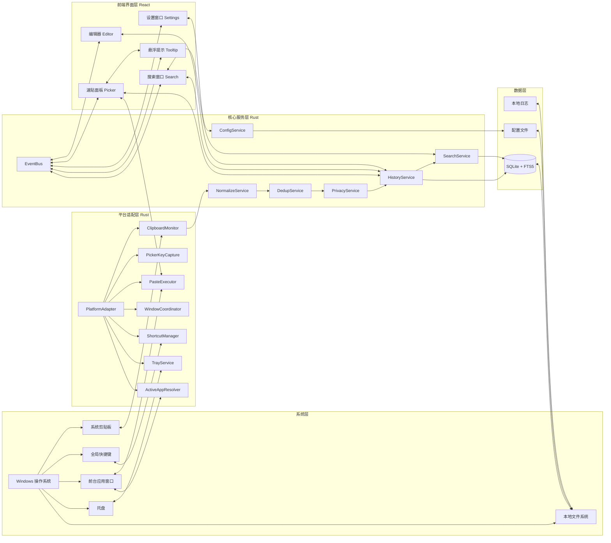
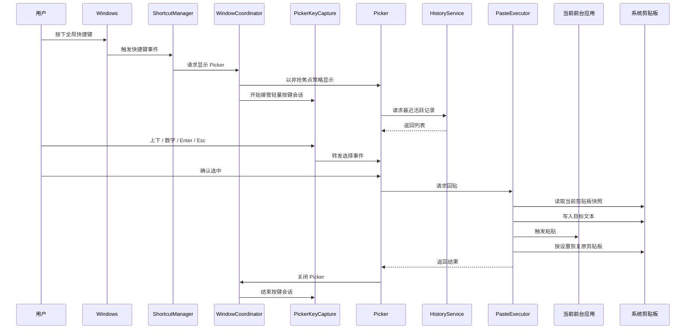
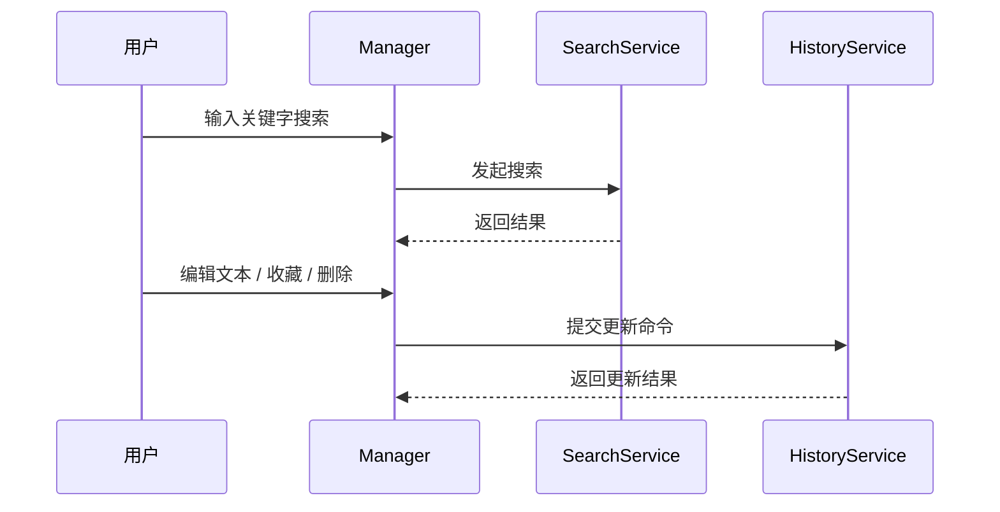

# FloatPaste / 浮贴 架构设计与 MVP 技术方案

> **现状说明**：桌面端为 Slint 软件渲染原生壳，仓库由两个 crate 组成：
> `crates/floatpaste-core`（领域 / 仓储 / 服务 / Win32 平台层，与 GUI 无关）与
> `crates/floatpaste-native`（唯一桌面壳：`ui/*.slint` 界面 + `src/` 窗口会话逻辑）。
> §18 目录结构、§20 实现状态、§21 运行调试描述当前结构；
> 其余章节为 Tauri + WebView MVP 时期的设计记录，产品与领域设计结论仍然有效，
> 其中涉及的 Tauri / 前端实现细节以本说明的 crate 结构为准。

## 1. 文档目标

本文档用于将 FloatPaste 的产品形态与技术选型收敛为一版可执行、可排期、可开发的正式方案。

本文档的目标是同时满足两件事：

1. 保留完整、清晰、适合评审的文档结构。
2. 将 MVP 范围收缩到真正可落地、低风险、可验证核心价值的实现边界。

本文档是“合并后的最终稿”，用于替代此前偏“产品目标版”的设计稿与偏“工程约束版”的设计说明。

---

## 2. 核心结论

### 2.1 产品定位

FloatPaste 是一个 **Windows 桌面剪贴板工具**，核心价值不是“保存很多剪贴内容”，而是：

- 持续记录剪贴历史
- 通过全局快捷键快速唤起速贴面板
- 在 **尽量不打断当前工作窗口** 的前提下，快速选择并重新粘贴历史内容
- 提供一个有焦点的资料库窗口，用于搜索、编辑、删除和收藏内容

### 2.2 首版产品形态

首版产品采用三段式结构：

- **后台常驻服务**：负责监听剪贴板、注册快捷键、管理托盘、执行回贴
- **速贴面板（Picker）**：高频入口，轻交互，尽量不抢焦点
- **资料库窗口（Manager）**：低频管理窗口，允许获取焦点

### 2.3 首版平台策略

**首发平台只支持 Windows。**

原因：

- “尽量不抢焦点”的体验是产品核心卖点，必须优先保证稳定性
- 回贴链路、窗口行为、托盘行为、全局快捷键在 Windows 上更适合形成稳定基线
- macOS 与 Linux 的焦点/注入/桌面环境差异先不进入首版范围

macOS 与 Linux 的支持保留在后续版本规划中，不纳入当前 MVP 的交付承诺。

### 2.4 已交付范围

当前版本（v0.2.x）已实现：

- **Windows**
- **文本剪贴项**（MVP）
- **图片剪贴项**（缩略图预览、悬浮大图、粘贴为文件路径）
- **文件剪贴项**（文件路径入库、文件数量/大小记录）
- **最近记录 / 收藏 / 删除 / 文本编辑 / 重新粘贴**
- **托盘、快捷键、排除应用、暂停监听**
- **主题定制**（浅色/深色/跟随系统 + 自定义颜色）
- **全局搜索窗口**（独立快捷键唤起、类型筛选、分页）
- **Tooltip 独立窗口**（鼠标悬停预览、屏幕边缘自适应定位）

以下能力未进入当前版本：

- 标签系统
- 云同步
- OCR
- AI 分类
- macOS / Linux 正式支持

---

## 3. 设计原则

### 3.1 不抢焦点优先于功能完备

首版最重要的设计原则不是“功能尽可能全”，而是：

**速贴面板的唤起、选择、粘贴这条核心链路，要尽量不打断当前工作上下文。**

因此：

- Picker 只承载轻交互
- Picker 不承担复杂编辑
- Picker 不承担完整搜索输入体验
- 深度搜索、文本编辑、批量管理一律进入 Manager 窗口

### 3.2 管理界面与速贴界面分离

- **Picker**：只做快速选择与回贴
- **Manager**：做完整搜索、编辑、删除、收藏、设置

### 3.3 本地优先

- 所有数据默认存储在本机
- 不向外部服务发送剪贴内容
- 所有历史、索引、配置、日志均保留本地

### 3.4 平台特化

虽然整体框架使用跨平台技术栈，但首版只做 Windows，因此涉及以下能力时允许使用 Windows 特化实现：

- 剪贴板监听
- 键盘输入捕获
- 当前前台窗口恢复/回贴
- 无焦点速贴面板交互

### 3.5 范围克制

MVP 的目标不是覆盖所有剪贴板数据类型，而是打穿一条稳定链路：

**复制文本 -> 自动入库 -> 快捷键唤起 -> 键盘选择 -> 重新粘贴成功**

---

## 4. 技术选型结论

### 4.1 技术栈

- 桌面容器：Tauri 2
- 系统核心：Rust
- 前端框架：React + Vite
- 样式方案：Tailwind CSS
- 前端状态：Zustand
- 数据获取：TanStack Query
- 本地数据库：SQLite
- 搜索方案：SQLite FTS5
- 日志：Rust tracing
- 配置：SQLite + JSON 配置文件

### 4.2 选型理由

- Tauri 2 适合轻量桌面常驻工具，前端与系统能力边界清晰。
- Rust 适合承接托盘、快捷键、剪贴板监听、平台适配和回贴执行。
- React 适合快速实现现代化界面与明确的组件边界。
- SQLite 足以承载本地持久化、全文搜索和后续迁移。

### 4.3 技术选型原则

- 前端不直接访问数据库
- 所有系统能力均在 Rust 层完成
- 所有平台相关能力统一收敛到 PlatformAdapter
- 所有数据库读写统一收敛到 Repository / Service 层

---

## 5. 总体架构

### 5.1 总体架构图


```mermaid
flowchart LR
    subgraph 系统层
        OS[Windows 操作系统]
        CB[系统剪贴板]
        HK[全局快捷键]
        TR[托盘]
        FG[前台应用窗口]
        FS[本地文件系统]
    end

    subgraph 平台适配层 Rust
        PA[PlatformAdapter]
        CM[ClipboardMonitor]
        KI[PickerKeyCapture]
        PE[PasteExecutor]
        WS[WindowCoordinator]
        SH[ShortcutManager]
        TS[TrayService]
        AA[ActiveAppResolver]
    end

    subgraph 核心服务层 Rust
        HS[HistoryService]
        SS[SearchService]
        NS[NormalizeService]
        DS[DedupService]
        PS[PrivacyService]
        CS[ConfigService]
        ES[EventBus]
    end

    subgraph 数据层
        DB[(SQLite + FTS5)]
        CFG[配置文件]
        LOG[本地日志]
    end

    subgraph 前端界面层 React
        PK[速贴面板 Picker]
        SR[搜索窗口 Search]
        ED[编辑器 Editor]
        ST[设置窗口 Settings]
        TT[悬浮提示 Tooltip]
    end

    OS --> CB
    OS --> HK
    OS --> TR
    OS --> FG
    OS --> FS

    CB <--> CM
    HK <--> SH
    TR <--> TS
    FG <--> PE
    FG <--> AA

    PA --> CM
    PA --> KI
    PA --> PE
    PA --> WS
    PA --> SH
    PA --> TS
    PA --> AA

    CM --> NS
    NS --> DS
    DS --> PS
    PS --> HS
    HS --> DB
    HS --> SS
    SS --> DB
    CS --> CFG
    ES <--> PK
    ES <--> SR
    ES <--> ED
    ES <--> ST
    ES <--> TT

    PK <--> HS
    PK <--> PE
    PK <--> TT
    SR <--> HS
    SR <--> SS
    ED <--> HS
    ST <--> CS

    DB <--> FS
    CFG <--> FS
    LOG <--> FS
```

### 5.2 核心交互时序图

#### 5.2.1 速贴主链路


```mermaid
sequenceDiagram
    participant U as 用户
    participant OS as Windows
    participant SM as ShortcutManager
    participant WC as WindowCoordinator
    participant KC as PickerKeyCapture
    participant PK as Picker
    participant HS as HistoryService
    participant PE as PasteExecutor
    participant APP as 当前前台应用
    participant CB as 系统剪贴板

    U->>OS: 按下全局快捷键
    OS->>SM: 触发快捷键事件
    SM->>WC: 请求显示 Picker
    WC->>PK: 以非抢焦点策略显示
    WC->>KC: 开始接管轻量按键会话
    PK->>HS: 请求最近活跃记录
    HS-->>PK: 返回列表
    U->>KC: 上下 / 数字 / Enter / Esc
    KC->>PK: 转发选择事件
    U->>PK: 确认选中
    PK->>PE: 请求回贴
    PE->>CB: 读取当前剪贴板快照
    PE->>CB: 写入目标文本
    PE->>APP: 触发粘贴
    PE->>CB: 按设置恢复原剪贴板
    PE-->>PK: 返回结果
    PK->>WC: 关闭 Picker
    WC->>KC: 结束按键会话
```

#### 5.2.2 管理窗口链路


```mermaid
sequenceDiagram
    participant U as 用户
    participant MG as Manager
    participant SS as SearchService
    participant HS as HistoryService

    U->>MG: 输入关键字搜索
    MG->>SS: 发起搜索
    SS-->>MG: 返回结果
    U->>MG: 编辑文本 / 收藏 / 删除
    MG->>HS: 提交更新命令
    HS-->>MG: 返回更新结果
```

---

## 6. 界面与职责分离

### 6.1 Picker（速贴面板）

职责：

- 展示最近活跃记录（文本、图片缩略图、文件摘要）
- 提供轻量预览（Tooltip 悬浮窗口显示图片大图或文本预览）
- 支持上下移动、数字直选、回车确认、Esc 关闭
- 支持收藏快捷键（Ctrl+Space）直接在 Picker 中切换收藏状态
- 图片条目支持 Shift+Enter 粘贴为文件路径
- 触发回贴
- 支持窗口宽度拖拽调整

不负责：

- 复杂文本输入
- 长列表全量搜索
- 文本编辑
- 标签管理
- 批量操作

#### 重要约束

**Picker 不提供自由文本搜索框**。

原因：

- 自由输入会显著增加焦点管理复杂度
- 中文输入法会放大”不抢焦点”实现成本
- 深度搜索通过全局搜索窗口独立提供

因此 Picker 的信息架构为：

- 最近活跃记录
- 快捷键提示

### 6.2 Search（搜索窗口）

职责：

- 完整历史浏览与全文搜索
- 类型筛选（全部 / 文本 / 图片 / 文件 / 收藏）
- 图片 Tooltip 预览与内联展开
- 调用编辑器窗口编辑文本
- 收藏 / 取消收藏
- 删除

Search 是一个正常获取焦点的桌面窗口，通过全局快捷键独立唤起。

### 6.3 Editor（编辑器窗口）

职责：

- 文本编辑
- 保存修改

Editor 从 Picker 或 Search 窗口唤出，编辑完成后返回来源窗口。

### 6.4 Settings（设置窗口）

职责：

- 快捷键配置（Picker 快捷键、搜索窗口快捷键）
- 通用设置（历史上限、速贴记录数）
- 外观设置（主题模式、自定义颜色、速贴位置模式）
- 行为设置（开机自启、静默启动、恢复剪贴板）
- 排除应用管理

Settings 是一个正常获取焦点的桌面窗口，通过托盘菜单或快捷方式打开。

### 6.5 Tooltip（悬浮提示窗口）

职责：

- 鼠标悬停时显示条目预览（图片大图或文本摘要）
- 屏幕边缘自适应定位
- 主题同步

Tooltip 是一个轻量级独立 WebviewWindow，不会抢占焦点，跟随鼠标位置动态显示。

### 6.6 托盘

职责：

- 常驻入口
- 打开搜索窗口 / 速贴面板
- 暂停 / 恢复监听
- 打开设置
- 退出

---

## 7. 分层说明

### 7.1 前端界面层

前端仅负责：

- 展示状态
- 呈现列表与预览
- 管理交互流程
- 调用 Tauri IPC 命令
- 响应事件总线通知

前端不直接负责：

- 剪贴板监听
- 快捷键注册
- 粘贴注入
- 数据库访问

### 7.2 核心服务层

核心服务层负责业务规则与状态组织。

- `HistoryService`：剪贴记录的创建、更新、删除、收藏与读取
- `SearchService`：FTS5 检索、排序、过滤（含类型筛选）
- `NormalizeService`：归一化文本内容、提取预览、生成哈希
- `DedupService`：基于哈希的短时间去重与历史记录刷新
- `PrivacyService`：排除应用、暂停监听、自写回抑制
- `ConfigService`：维护配置与运行期设置（含主题配置）
- `ImageStorage`：图片存储、PNG 编解码、文件管理
- `EventBus`：向前端广播状态变化

### 7.3 平台适配层

平台适配层只做 Windows 适配，是首版稳定性的关键。

- `ClipboardMonitor`：监听系统剪贴板变化（文本 + 图片 + 文件）
- `ImageClipboard`：图片剪贴板数据读取与写入（PNG 直传、DIB 格式转换）
- `FileClipboard`：文件剪贴板数据读取
- `PickerKeyCapture`：在 Picker 显示期间接管轻量按键输入
- `PasteExecutor`：将选中记录回贴到当前前台应用
- `WindowCoordinator`：控制 Picker / Search / Editor / Settings / Tooltip 窗口的显示隐藏与焦点策略
- `TooltipWindow`：管理 Tooltip 独立窗口的创建、定位与显示
- `ShortcutManager`：注册和更新全局快捷键（Picker + Search）
- `TrayService`：托盘菜单与运行状态切换
- `ActiveAppResolver`：识别当前前台应用，供排除策略使用
- `PlatformAdapter`：统一抽象 Windows 原生能力

### 7.4 数据层

- SQLite：记录、FTS 索引、收藏状态、配置快照
- 配置文件：基础运行配置与兼容性参数
- 本地日志：错误诊断和问题追踪

---

## 8. 模块拆分

| 模块 | 主要职责 | 输入 | 输出 | 依赖 |
| --- | --- | --- | --- | --- |
| Picker | 最近活跃记录展示（文本/图片/文件）、轻量选择、Tooltip 预览、触发回贴 | 快捷键事件、按键会话、列表数据 | 粘贴命令、关闭命令、编辑器唤起 | HistoryService、PasteExecutor、TooltipWindow |
| Search | 全文搜索、类型筛选、收藏管理、编辑器唤起 | 用户输入、编辑动作、筛选条件 | 更新命令、搜索结果 | HistoryService、SearchService |
| Editor | 文本编辑与保存 | 条目 ID、原始文本 | 更新命令 | HistoryService |
| Settings | 快捷键、外观、行为、排除应用等配置 | 用户输入 | 设置变更命令 | ConfigService |
| Tooltip | 鼠标悬停预览（图片大图/文本摘要） | 鼠标位置、条目数据 | 显示/隐藏窗口 | WindowCoordinator |
| Tray UI | 托盘入口、暂停监听、打开搜索/设置 | 托盘点击 | 状态切换、窗口命令 | TrayService、ConfigService |
| ClipboardMonitor | 监听剪贴板变化（文本/图片/文件） | Windows 剪贴板事件 | 原始剪贴板候选 | PlatformAdapter |
| NormalizeService | 文本归一化与预览生成 | 原始剪贴板内容 | 标准化文本项 | ClipboardMonitor |
| ImageStorage | 图片存储与编解码 | 剪贴板图片数据 | PNG 文件路径、尺寸、哈希 | ClipboardMonitor |
| DedupService | 去重 | 标准化条目 | 允许写入 / 刷新已有记录 / 拒绝写入 | NormalizeService |
| PrivacyService | 排除应用、自写回过滤、暂停监听 | 标准化条目、前台应用、配置 | 允许写入 / 拒绝写入 | ConfigService、ActiveAppResolver |
| HistoryService | 记录增删改查与收藏 | 新剪贴项、编辑命令 | 列表、详情、事件 | SQLite |
| SearchService | 全文检索、排序、过滤 | 查询词、筛选条件（含类型过滤） | 搜索结果 | SQLite FTS5 |
| PasteExecutor | 回贴选中项（文本粘贴/图片粘贴为文件路径） | itemId、回贴选项（pasteToTarget、asFile） | 回贴结果 | PlatformAdapter |
| ShortcutManager | 全局快捷键注册与更新（Picker + Search） | 设置变更 | 快捷键事件 | Windows API |
| WindowCoordinator | 管理 Picker/Search/Editor/Settings/Tooltip 窗口行为 | 显示/隐藏请求 | UI 状态变化 | Tauri Window |
| PlatformAdapter | 屏蔽 Windows 原生 API 细节 | 系统调用请求 | 能力结果 | Windows 实现 |

---

## 9. 关键能力设计

### 9.1 剪贴监听

当前版本支持三种剪贴板数据类型：

**文本**：
- 保存原始文本、预览文本、搜索文本
- 保存来源应用信息
- 保存创建时间、最近使用时间、收藏状态

**图片**：
- 监听剪贴板图片数据（支持 PNG 直传和 DIB 标准格式）
- 生成缩略图用于列表预览
- 保存为本地 PNG 文件，记录尺寸和文件大小
- 哈希去重（基于图片像素内容）

**文件**：
- 监听剪贴板文件列表
- 记录文件路径列表、文件数、目录数、总大小

监听策略：

- 对 8 秒窗口内的重复内容直接跳过
- 对历史上已存在的同 hash 内容刷新既有记录时间，而不是重复插入
- 支持排除应用名单
- 支持暂停监听
- 支持对”程序自己写回 clipboard”的情况做抑制，避免回贴后再次入库

### 9.2 搜索与排序

#### Picker 的排序策略

Picker 首版不做全文搜索，只做：

- 最近活跃优先
- 未使用过的记录以创建时间作为最近活跃时间

#### Manager 的搜索策略

Manager 支持全文搜索，排序优先级：

- 最近活跃优先
- 文本内容匹配优先
- 来源应用与时间过滤次之

当前实现补充：

- 前端输入采用 `250ms` 防抖，减少高频 IPC 与 FTS 查询抖动
- 默认按 `50` 条一页请求搜索结果，通过 `offset + limit` 翻页

#### 搜索协议约定

为避免前后端并行实现时出现协议歧义，首版将搜索协议固定如下：

```ts
type ClipType = "text" | "image" | "file";
type SearchSort = "relevance_desc" | "recent_desc";

interface SearchFilters {
  favoritedOnly?: boolean;
  clipType?: ClipType | null;
  sourceApp?: string | null;
  includeDeleted?: false;
}

interface SearchQuery {
  keyword: string;
  filters: SearchFilters;
  offset: number;
  limit: number;
  sort: SearchSort;
}

interface SearchResultItem {
  id: string;
  type: ClipType;
  contentPreview: string;
  tooltipText?: string | null;
  sourceApp: string | null;
  isFavorited: boolean;
  fileCount: number;
  directoryCount: number;
  createdAt: string;
  updatedAt: string;
  lastUsedAt: string | null;
  imagePath?: string | null;
  imageWidth?: number | null;
  imageHeight?: number | null;
  imageFormat?: string | null;
  fileSize?: number | null;
}

interface SearchResult {
  items: SearchResultItem[];
  total: number;
  offset: number;
  limit: number;
}
```

首版默认规则：

- `keyword` 允许为空字符串
- 当 `keyword` 为空时，`sort` 强制按 `recent_desc`
- 当 `keyword` 非空时，默认按 `relevance_desc`
- `filters.favoritedOnly` 默认 `false`
- `filters.clipType` 默认 `null`（不过滤类型），可设为 `"text"` / `"image"` / `"file"`
- `filters.sourceApp` 默认 `null`
- `filters.includeDeleted` 固定为 `false`，前端不暴露该选项
- `limit` 默认 `50`，最大 `100`
- `offset` 默认 `0`

排序落地规则：

- `recent_desc`：按 `COALESCE(last_used_at, created_at) DESC`，若相同再按 `created_at DESC`
- `relevance_desc`：先按 `FTS5 bm25 ASC`，再按 `COALESCE(last_used_at, created_at) DESC`，最后按 `created_at DESC`
- 收藏状态保留为独立属性与筛选条件，不参与默认历史排序，也不在 Picker 中单独置顶

### 9.3 回贴执行

回贴链路遵循以下原则：

- Picker 负责”选择”，不负责系统粘贴细节
- PasteExecutor 负责将目标内容写入系统剪贴板
  - 文本条目：写入文本，触发 Ctrl+V
  - 图片条目（Enter）：写入图片数据到剪贴板，触发 Ctrl+V
  - 图片条目（Shift+Enter）：将图片文件路径写入剪贴板，触发 Ctrl+V（粘贴为文件路径）
- PasteExecutor 负责触发系统粘贴动作
- 可选恢复此前的剪贴板内容
- 回贴失败必须返回明确错误码

PasteOption 扩展：

```rust
struct PasteOption {
    restore_clipboard_after_paste: bool,
    paste_to_target: bool,   // 是否注入到目标窗口
    as_file: bool,           // 图片条目是否粘贴为文件路径
}
```

### 9.4 焦点与窗口策略

首版明确区分两类界面：

- **Picker**：尽量不抢前台工作窗口焦点，强调快速选择与回贴
- **Manager**：正常获取焦点，用于管理和编辑

窗口策略原则：

- Picker 只承载轻交互，不承载复杂输入
- Picker 采用“从创建开始即按无焦点窗口设计”的策略
- 不在首版承诺 Picker 内自由文本输入
- Windows 是唯一首发平台，不引入跨平台窗口行为妥协

---

## 10. 核心接口草案

### 10.1 Rust 服务接口

```rust
trait ClipboardMonitor {
    fn start(&self) -> Result<(), AppError>;
    fn stop(&self) -> Result<(), AppError>;
    fn is_running(&self) -> bool;
}

trait HistoryRepository {
    fn save_item(&self, item: ClipItem) -> Result<ClipItem, AppError>;
    fn list_recent(&self, limit: u32) -> Result<Vec<ClipItem>, AppError>;
    fn list_favorites(&self, limit: u32) -> Result<Vec<ClipItem>, AppError>;
    fn get_detail(&self, id: String) -> Result<ClipItemDetail, AppError>;
    fn delete_item(&self, id: String) -> Result<(), AppError>;
    fn update_text(&self, id: String, text: String) -> Result<ClipItem, AppError>;
    fn set_favorited(&self, id: String, value: bool) -> Result<(), AppError>;
    fn mark_used(&self, id: String) -> Result<(), AppError>;
}

trait SearchService {
    fn search(&self, query: SearchQuery) -> Result<SearchResult, AppError>;
}

trait PasteExecutor {
    fn paste_item(&self, item_id: String, option: PasteOption) -> Result<PasteResult, AppError>;
}

trait PlatformAdapter {
    fn register_shortcut(&self, shortcut: String) -> Result<(), AppError>;
    fn show_picker(&self) -> Result<(), AppError>;
    fn hide_picker(&self) -> Result<(), AppError>;
    fn begin_picker_key_session(&self) -> Result<(), AppError>;
    fn end_picker_key_session(&self) -> Result<(), AppError>;
    fn current_foreground_app(&self) -> Result<Option<AppIdentity>, AppError>;
    fn snapshot_clipboard_text(&self) -> Result<ClipboardSnapshot, AppError>;
    fn write_clipboard_text(&self, text: String) -> Result<(), AppError>;
    fn write_clipboard_image(&self, image_data: &[u8]) -> Result<(), AppError>;
    fn restore_clipboard_text(&self, snapshot: ClipboardSnapshot) -> Result<(), AppError>;
    fn trigger_paste(&self) -> Result<(), AppError>;
}
```

补充类型约定：

```rust
enum ClipType {
    Text,
    Image,
    File,
}

struct ClipboardSnapshot {
    text: Option<String>,
}

enum SearchSort {
    RelevanceDesc,
    RecentDesc,
}

struct SearchQuery {
    keyword: String,
    filters: SearchFilters,
    offset: u32,
    limit: u32,
    sort: SearchSort,
}

struct SearchFilters {
    favorited_only: Option<bool>,
    clip_type: Option<ClipType>,
    source_app: Option<String>,
    include_deleted: Option<bool>,
}

struct SearchResult {
    items: Vec<ClipItemSummary>,
    total: u32,
    offset: u32,
    limit: u32,
}

struct ClipItemSummary {
    id: String,
    r#type: String,
    content_preview: String,
    tooltip_text: Option<String>,
    source_app: Option<String>,
    is_favorited: bool,
    file_count: i32,
    directory_count: i32,
    created_at: String,
    updated_at: String,
    last_used_at: Option<String>,
    image_path: Option<String>,
    image_width: Option<i32>,
    image_height: Option<i32>,
    image_format: Option<String>,
    file_size: Option<i64>,
}

struct ClipItemDetail {
    id: String,
    r#type: String,
    content_preview: String,
    full_text: String,
    search_text: String,
    source_app: Option<String>,
    is_favorited: bool,
    created_at: String,
    updated_at: String,
    last_used_at: Option<String>,
    hash: String,
    image_path: Option<String>,
    image_width: Option<i32>,
    image_height: Option<i32>,
    image_format: Option<String>,
    file_size: Option<i64>,
    file_paths: Vec<String>,
    file_count: i32,
    directory_count: i32,
    total_size: Option<i64>,
}

struct PasteOption {
    restore_clipboard_after_paste: bool,
    paste_to_target: bool,
    as_file: bool,
}

struct PasteResult {
    success: bool,
    code: String,
    message: String,
}
```

回贴流程约束：

1. `PasteExecutor` 先调用 `snapshot_clipboard_text()`
2. 再写入目标文本并触发粘贴
3. 如果 `restoreClipboardAfterPaste = true`，则在短延迟后调用 `restore_clipboard_text(snapshot)`
4. `PrivacyService` 必须在恢复阶段和目标写入阶段都应用自写回抑制，避免两次重复入库
5. 首版 `ClipboardSnapshot` 只处理文本；未来若支持图片或文件，再扩展为枚举结构

### 10.2 Tauri IPC 命令边界

前端与 Rust 的命令边界统一收敛为：

**剪贴项操作**
- `list_recent_items(limit)`
- `list_favorite_items(limit)`
- `get_item_detail(id)`
- `search_items(query)`
- `update_text_item(id, text)`
- `delete_item(id)`
- `set_item_favorited(id, value)`
- `paste_item(id, option)`

**窗口管理**
- `show_picker()`
- `hide_picker()`
- `open_settings()`
- `open_editor_from_picker(item_id)`
- `open_editor_from_search(item_id)`
- `hide_editor()`
- `open_search_global()`
- `hide_search()`
- `prepare_search_window_drag()`

**Tooltip**
- `show_tooltip(request_id, x, y, html, theme, theme_vars)`
- `tooltip_ready(request_id, width, height)`
- `hide_tooltip()`

**设置**
- `get_settings()`
- `update_settings(payload)`
- `pause_monitoring()`
- `resume_monitoring()`

---

## 11. 数据模型草案

### 11.1 核心实体

```ts
type ClipType = "text" | "image" | "file";

interface ClipItemSummary {
  id: string;
  type: ClipType;
  contentPreview: string;
  tooltipText?: string | null;
  sourceApp: string | null;
  isFavorited: boolean;
  fileCount: number;
  directoryCount: number;
  createdAt: string;
  updatedAt: string;
  lastUsedAt: string | null;
  // 图片特有
  imagePath?: string | null;
  imageWidth?: number | null;
  imageHeight?: number | null;
  imageFormat?: string | null;
  fileSize?: number | null;
}

interface ClipItemDetail {
  id: string;
  type: ClipType;
  contentPreview: string;
  fullText: string;
  searchText: string;
  sourceApp: string | null;
  isFavorited: boolean;
  createdAt: string;
  updatedAt: string;
  lastUsedAt: string | null;
  hash: string;
  // 图片特有
  imagePath?: string | null;
  imageWidth?: number | null;
  imageHeight?: number | null;
  imageFormat?: string | null;
  fileSize?: number | null;
  // 文件特有
  filePaths: string[];
  fileCount: number;
  directoryCount: number;
  totalSize?: number | null;
}

interface UserSetting {
  shortcut: string;
  searchShortcut: string;
  searchShortcutEnabled: boolean;
  launchOnStartup: boolean;
  silentOnStartup: boolean;
  historyLimit: number;
  pickerRecordLimit: number;
  pickerPositionMode: "mouse" | "lastPosition" | "caret";
  themeMode: "system" | "light" | "dark";
  customThemeColors: {
    light: { windowBg: string; cardBg: string; accent: string };
    dark: { windowBg: string; cardBg: string; accent: string };
  };
  excludedApps: string[];
  restoreClipboardAfterPaste: boolean;
  pauseMonitoring: boolean;
}
```

### 11.2 SQLite 表结构

当前表结构：

- `clip_items`
- `clip_items_fts`
- `excluded_apps`
- `settings`

#### `clip_items`

| 字段 | 类型 | 说明 |
| --- | --- | --- |
| id | TEXT PK | 记录 ID |
| type | TEXT | 条目类型：text / image / file |
| full_text | TEXT | 原始全文（文本条目） |
| preview_text | TEXT | 列表预览 |
| search_text | TEXT | 搜索文本 |
| source_app | TEXT NULL | 来源应用 |
| is_favorited | INTEGER | 是否收藏 |
| hash | TEXT | 去重哈希 |
| image_path | TEXT NULL | 图片存储路径 |
| image_width | INTEGER NULL | 图片宽度 |
| image_height | INTEGER NULL | 图片高度 |
| image_format | TEXT NULL | 图片格式（png） |
| file_size | INTEGER NULL | 文件大小（字节） |
| file_paths | TEXT NULL | 文件路径列表（JSON 数组） |
| file_count | INTEGER | 文件数量 |
| directory_count | INTEGER | 目录数量 |
| total_size | INTEGER NULL | 文件总大小 |
| created_at | INTEGER | 创建时间 |
| updated_at | INTEGER | 更新时间 |
| last_used_at | INTEGER NULL | 最近使用时间 |
| deleted_at | INTEGER NULL | 软删除时间 |

#### `clip_items_fts`

用于全文搜索，索引字段：

- `full_text`
- `search_text`
- `source_app`

### 11.3 存储策略

- 文本直接存储在 SQLite
- 图片以 PNG 格式存储在应用数据目录下的 `images/` 子目录中
- 文件条目仅记录路径引用，不复制文件内容
- 删除采用软删除，后续可定期清理

---

## 12. Windows 首发策略

### 12.1 首发范围

首发平台：

- Windows 10
- Windows 11

### 12.2 支持能力

| 能力 | Windows 首发要求 |
| --- | --- |
| 全局快捷键 | 强支持 |
| 无焦点 Picker | 强支持，作为核心体验目标 |
| 剪贴板监听 | 强支持 |
| 回贴执行 | 强支持 |
| 托盘常驻 | 强支持 |
| 文本搜索 | 强支持 |

### 12.3 后续平台规划

后续版本可考虑：

- macOS：作为第二平台评估
- Linux：在桌面环境差异可接受时进入实验支持

但这些内容不进入当前版本范围，也不写入当前交付承诺。

---

## 13. 已实现功能范围

### 13.1 已实现

- 文本剪贴项记录
- 图片剪贴项记录（缩略图预览、悬浮大图、粘贴为文件路径）
- 文件剪贴项记录（路径入库、文件数量/大小记录）
- 最近记录列表
- 收藏 / 取消收藏（Picker 内 Ctrl+Space 快捷键）
- 删除记录
- 文本编辑（独立编辑器窗口）
- 搜索窗口全文搜索 + 类型筛选
- 速贴面板快捷键唤起
- 方向键 / 数字键 / Enter / Esc 完成速贴闭环
- 选中项快速回贴（文本/图片/图片文件路径）
- Tooltip 悬浮预览窗口
- 主题定制（浅色/深色/跟随系统 + 自定义颜色）
- 托盘菜单
- 基础设置
- 排除应用名单
- 暂停监听
- 本地日志与基础错误提示

### 13.2 未实现

- Picker 内自由文本搜索
- 标签系统
- OCR
- 富文本结构化编辑
- 云同步
- 团队共享
- AI 分类 / 摘要
- 多设备同步
- macOS / Linux 支持

---

## 14. 非功能要求

- Picker 唤起需体感即时
- 最近 1000 条文本记录的 Manager 搜索需保持流畅
- 后台常驻进程不应长期占用异常 CPU
- 数据默认本地存储，不上传外部服务
- 快捷键唤起失败、回贴失败、监听失败应有可诊断日志
- 搜索接口默认分页参数应保证单次查询不超过 100 条

---

## 15. 风险与降级策略

### 15.1 焦点行为问题

风险：

- 无焦点 Picker 的真实行为可能受窗口创建顺序、输入法、系统前台窗口状态影响

策略：

- Picker 从创建开始即按无焦点窗口设计
- 首版不在 Picker 中支持自由输入
- 所有轻量选择按键由平台层接管

### 15.2 回贴稳定性问题

风险：

- 不同前台应用对粘贴注入的响应存在差异

策略：

- 所有回贴逻辑统一封装在 PasteExecutor
- 失败时给出错误码与日志
- 提供“恢复原剪贴板”开关

### 15.3 隐私与敏感内容

风险：

- 密码管理器、终端、远程桌面、隐私场景不适合被记录

策略：

- 提供排除应用名单
- 提供暂停监听
- 后续再评估敏感应用预设

### 15.4 范围膨胀

风险：

- 若首版同时引入图片、文件、跨平台支持，会显著稀释核心链路打磨质量

策略：

- 明确锁定 Windows + Text only MVP
- 其他能力在 v1.1 / v1.2 再逐步引入

---

## 16. 验收场景

### 16.1 功能验收

- 复制一段文本后能够自动入库
- 资料库中能够搜索到该文本
- 资料库中可编辑文本并保存
- 收藏状态可切换，且收藏项可在资料库收藏区独立查看
- 删除记录后，列表与搜索结果同步消失
- 选中历史项后能够重新粘贴到当前应用

### 16.2 交互验收

- 全局快捷键能够稳定唤起 Picker
- Picker 可通过方向键、数字键、回车、Esc 完成完整操作
- Picker 唤起和关闭不应明显打断前台工作流
- Manager 可正常获取焦点并进行搜索和编辑
- 托盘菜单可切换监听状态并打开资料库

### 16.3 Windows 平台验收

- 在 Windows 10 / 11 上可完成监听、搜索、回贴、托盘基础链路
- 常见桌面应用中速贴闭环可用
- 快捷键冲突或注册失败时可被感知并记录

---

## 17. 实施顺序建议

### Phase 1：后台核心闭环

- 完成 SQLite 模型
- 完成 ClipboardMonitor
- 完成 Normalize / Dedup / Privacy 链路
- 完成 HistoryService
- 完成 SearchQuery / SearchResult 协议与 FTS 查询实现
- 完成基本日志

### Phase 2：资料库窗口

- 完成 Manager 列表与详情
- 完成全文搜索
- 完成编辑 / 删除 / 收藏
- 完成设置基础项

### Phase 3：速贴主链路

- 完成 PickerWindow
- 完成 WindowCoordinator
- 完成 ShortcutManager
- 完成 PickerKeyCapture
- 完成 PasteExecutor
- 打通无焦点速贴闭环

### Phase 4：收口与稳定性

- 托盘菜单
- 排除应用
- 暂停监听
- 快捷键冲突提示
- 恢复原剪贴板
- 错误提示与日志完善

---

## 18. 当前目录结构

```text
floatpaste/
  crates/
    floatpaste-core/            # 与 GUI 无关的共享核心
      src/
        domain/                 # clip_item / settings / events / search_session / editor_session / error
        repository/             # sqlite_repository（含 FTS5 与迁移）/ schema / settings
        services/               # clip / search / history / normalize / dedup / privacy / retention /
                                # paste_support / picker_position / image_storage / startup / tag /
                                # time_format / clip_display（展示格式化）
        platform/windows/       # clipboard_monitor / session_keyboard / mouse_monitor / hotkey /
                                # window_control（拖拽与八方向拉伸手势）/ active_app / picker_position /
                                # image_clipboard / file_clipboard / single_instance / startup / clipboard_error / wide_string
        state.rs                # CoreState：仓储 + 图片存储 + 设置缓存 + 自写保护
        theme.rs                # 色板 / 强调色 / 语义 token 派生与对比度校正
        launch_mode.rs          # --silent 启动模式
    floatpaste-native/          # 唯一桌面壳（Slint 软件渲染）
      src/
        main.rs                 # 启动装配：窗口创建、热键、托盘、监听接线、退出收尾
        system.rs               # 日志初始化与核心状态构建（数据目录解析）
        picker.rs               # 速贴面板会话（显隐/列表/导航/收藏/确认上屏）+ wire()
        search.rs               # 搜索会话（关键词防抖/筛选/分页/两段式删除）+ wire()
        editor.rs               # 文本编辑与标签管理 + wire()
        settings.rs             # 设置防抖自动保存与运行时联动 + wire()
        tooltip.rs              # 悬停预览（400ms 调度、边缘自适应）
        overlay.rs              # 窗口屏外停屏与上屏装配（防首帧闪烁）
        paste_flow.rs           # 回贴流程编排
        tray.rs                 # 系统托盘
        thumbnails.rs           # 缩略图缓存与异步解码（两窗口共享）
        theme_bridge.rs         # core token → Slint Theme 全局
        win32_ext.rs / app_icon.rs / app_state.rs
      ui/                       # picker / search / editor / settings / tooltip / theme / common .slint
      assets/icon.ico
      floatpaste-native.rc / .manifest
  packaging/                    # Inno 安装包脚本（floatpaste.iss）
  scripts/                      # bump-version / render-release-notes / make_icon / win-cargo
  docs/
```

---

## 19. 最终决策摘要

首版最终决策如下：

- 框架：Tauri 2
- 前端：React + TypeScript + Tailwind
- 核心：Rust
- 存储：SQLite + FTS5
- 平台：**Windows only**
- 数据类型：**Text only**
- 产品形态：后台常驻 + 无焦点 Picker + 有焦点 Manager
- 核心卖点：**不打断工作流的历史找回与重新粘贴**

这是当前最适合正式开工的版本。

---

## 20. 当前实现状态

桌面端为 Slint 原生壳单实现，核心域在 `floatpaste-core`，两个 crate 共同构成 Cargo workspace。

### 20.1 已完成

**基础架构**
- Cargo workspace：`floatpaste-core`（domain / repository / services / platform 四层）+ `floatpaste-native`（Slint 壳）
- SQLite 初始化迁移与 FTS5 搜索；`clip_items`、`clip_items_fts`、`settings`、`excluded_apps` 持久化
- 五窗口单进程模型：速贴 / 搜索 / 编辑 / 设置 / Tooltip 共享一个事件循环，启动即建、按需显示

**剪贴板监听**
- 文本 / 图片（PNG 直传与 DIB）/ 文件三类剪贴项监听与入库
- 图片存储（PNG 编解码、本地文件、哈希去重）；8 秒内重复跳过，历史重复刷新既有记录
- 排除应用、暂停监听、自写回抑制

**速贴面板（Picker）**
- 最近活跃列表（文本 + 图片缩略图 + 文件摘要）、无焦点显示（`WS_EX_NOACTIVATE` + 停屏/上屏切换）
- 会话快捷键（`Up / Down / Enter / Esc / Tab / Digit1..9`，LL 键盘钩子接管，方向键长按连发）
- 三种定位（鼠标 / 上次位置 / 目标插入符）、尺寸记忆、外击自动关闭、Tooltip 悬停预览
- 收藏、八方向拉伸（最小尺寸约束）、图片 Shift+Enter 按文件粘贴

**搜索窗口（Search）**
- 全文搜索（FTS5）+ 防抖 + 触底分页；类型筛选（全部 / 文本 / 图片 / 文件 / 收藏）与标签筛选
- 两段式删除（首次待确认 3 秒）、收藏视图联动、高度棘轮与头部拖拽

**编辑器（Editor）**
- 独立窗口文本编辑，脏内容关闭确认；从 Picker 或 Search 唤出，关闭后原样返回来源窗口
- 标签管理（追加 / 采纳建议 / 补全 / 移除）

**设置（Settings）**
- 快捷键捕获、通用 / 外观 / 行为 / 排除应用管理
- 防抖自动保存 + 运行时联动（热键重注册、自启同步、全窗主题重应用）

**主题系统**
- 浅色 / 深色 / 跟随系统 × 预设（默认 / Catppuccin / Tokyo Night）× 强调色安全列表
- 派生与对比度校正在 `core::theme`，经 `theme_bridge` 写入各窗口 Slint 全局

**回贴与系统集成**
- 回贴链路：写入剪贴板 → 恢复目标窗口 → 注入 Ctrl+V；图片可按文件路径回贴
- 托盘菜单（打开速贴 / 搜索 / 设置、切换监听、退出）、开机自启、`--silent` 静默启动、单实例二次唤起

### 20.2 关键文件索引

**floatpaste-native（壳）**
- 启动装配：`crates/floatpaste-native/src/main.rs`、`system.rs`
- 窗口会话：`picker.rs`、`search.rs`、`editor.rs`、`settings.rs`（各含 `wire()` 回调装配）
- 悬停预览：`tooltip.rs`；停屏与上屏：`overlay.rs`；回贴编排：`paste_flow.rs`；托盘：`tray.rs`
- 缩略图：`thumbnails.rs`；主题桥：`theme_bridge.rs`；共享状态：`app_state.rs`
- 界面：`crates/floatpaste-native/ui/*.slint`

**floatpaste-core（核心域）**
- 剪贴监听：`platform/windows/clipboard_monitor.rs`；图片 / 文件剪贴板：`image_clipboard.rs`、`file_clipboard.rs`
- 会话键盘（LL 钩子）：`session_keyboard.rs`；外击关闭（LL 鼠标钩子）：`mouse_monitor.rs`
- 窗口手势（拖拽 / 拉伸）：`window_control.rs`；前台与焦点解析：`active_app.rs`
- 定位：`picker_position.rs` + `services/picker_position_service.rs`
- 全局热键：`hotkey.rs`；单实例：`single_instance.rs`；开机自启：`startup.rs`
- 仓储：`repository/sqlite_repository.rs`；展示格式化：`services/clip_display.rs`
- 主题：`theme.rs`；回贴支撑：`services/paste_support.rs`

### 20.3 已知实现取舍

- 无焦点体验依赖 Win32 焦点恢复、低级键盘 / 鼠标钩子与热键注册时序；窗口显隐走「屏外停屏 + 上屏移动」，避免 `ShowWindow` 的焦点副作用与首帧闪烁
- 头部拖拽与八方向拉伸使用非模态手势（Slint 事件驱动 down/move/up），规避系统模态循环吞掉指针抬起事件
- 回贴优先保证「写入剪贴板 + 尝试恢复目标窗口 + 注入 Ctrl+V」，注入失败时提示手动粘贴
- 光标定位依赖 `GetGUIThreadInfo`；目标线程无插入符时回退鼠标定位
- Slint 软件渲染，五窗口单进程；`slint::Image` 非 `Send`，缩略图跨线程只传原始像素

## 21. 运行与调试说明

### 21.1 环境要求

- Rust 稳定版工具链（MSVC 目标）
- Windows 10 或 Windows 11 x64

### 21.2 常用命令

| 命令 | 说明 |
|------|------|
| `cargo run -p floatpaste-native` | 运行桌面应用（debug 构建保留控制台日志） |
| `cargo test` | 运行 `floatpaste-core` 与 `floatpaste-native` 全部测试 |
| `cargo build --release -p floatpaste-native` | 发布构建（产物 `target/release/floatpaste.exe`） |
| `node scripts/bump-version.mjs <版本>` | 同步 package.json / native Cargo.toml / Cargo.lock 三处版本 |

发版由 tag 驱动的 GitHub Actions 完成（Inno 安装包 + 便携 zip），见 `docs/release/流程.md`。

### 21.3 运行时调试

- 日志：debug 构建同时输出控制台并按天滚动写入 `%APPDATA%\com.floatpaste\logs\floatpaste-native.log`
- 数据：`%APPDATA%\com.floatpaste\floatpaste.db`（SQLite + FTS5），图片存同目录 `images/`
- 静默启动：命令行 `--silent`（跳过自动开面板，托盘 / 快捷键 / 监听照常）
- 二次启动：单实例命名事件唤醒已有实例的速贴会话后退出

### 21.4 调试场景建议

建议按下面顺序验证：

1. 运行 `cargo run -p floatpaste-native`
2. 在任意文本应用中复制一段文本，确认自动入库
3. 通过全局快捷键（默认 `Alt+Q`）唤起 Picker
4. 用 `Up / Down / Enter / Esc / 1..9` 验证 Picker 会话快捷键操作，方向键长按可连续导航
5. 点击 Picker 窗口外部，确认窗口自动关闭并恢复原目标窗口
6. 复制一张图片，确认 Picker 显示缩略图；鼠标悬停查看 Tooltip 大图预览
7. 在 Picker 中对图片条目按 Shift+Enter，确认粘贴为文件路径
8. 通过全局快捷键（默认 `Alt+S`）唤起搜索窗口
9. 在搜索窗口输入关键字，确认搜索防抖与翻页功能正常
10. 使用筛选下拉框切换类型（文本/图片/文件/收藏），确认筛选结果正确
11. 在搜索窗口点击条目进入编辑器，编辑后保存
12. 在设置中切换主题模式（浅色/深色/跟随系统），确认所有窗口主题同步
13. 在设置中切换预设与强调色，确认各窗口生效
14. 在记事本、浏览器输入框、编辑器中验证回贴行为
15. 在设置中加入排除应用，确认对应前台应用不再入库
16. 通过托盘切换监听状态，确认暂停后不再继续入库

### 21.5 当前调试限制

- 不同应用对 `Ctrl+V` 注入的响应存在差异
- Picker 的无焦点体验依赖 Win32 焦点恢复、低级鼠标钩子和快捷键注册时序
- 尚未提供单独的日志查看器界面，主要依赖日志文件与数据库结果观察
