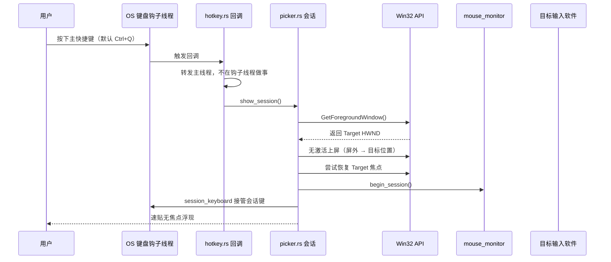
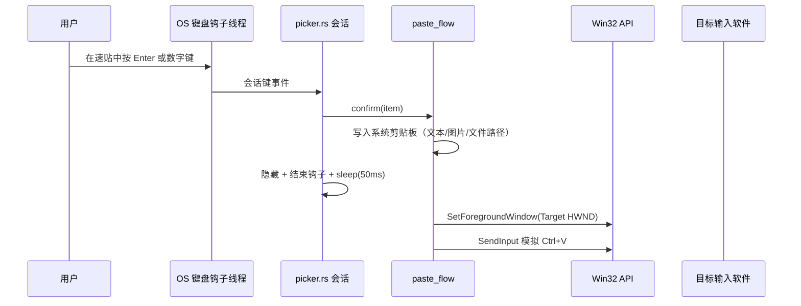

# 无焦点速贴窗口架构与防坑指南

> 活文档：记录速贴无焦点窗口的现行架构与踩坑结论，随实现更新。改窗口生命周期/焦点策略前必读（含 [ADR-0002](adr-0002-picker-docked-mode.md) 停靠形态的实施）。

## 1. 架构概述

速贴窗口（Picker）在用户按下全局快捷键（默认 `Ctrl+Q`）时瞬间呼出，并且**尽量不抢占当前正在工作的目标软件（如 Word、代码编辑器）的输入焦点**。用户在速贴中可以使用会话快捷键（`Up / Down / Enter / Escape / 1-9`）、双击条目，或直接点击窗口外部结束本次速贴会话。速贴支持文本、图片和文件条目的展示与上屏，图片条目支持悬浮大图预览和 Shift+Enter 按文件路径上屏。

当前实现（Slint 原生壳）的关键链路：

1. **五窗启动即建**：`main.rs` 启动即创建全部窗口（速贴/搜索/编辑/设置/悬浮气泡）。速贴/搜索/悬浮气泡平时屏外停屏、按需上屏（`overlay.rs`），winit 窗口常驻；编辑/设置窗隐藏即销毁回收帧缓冲、重开两段式重建。避免动态建窗的时序坑（见坑一、坑八）。
2. **智能定位策略**：根据设置优先贴近鼠标、上次关闭位置或目标窗口插入符位置，并在超出工作区时自动回收至可见区域。
3. **Win32 无焦点显示**：通过 `WS_EX_NOACTIVATE` 与无激活上屏避免抢占焦点，并在必要时立即恢复目标窗口。
4. **会话期键盘接管**：速贴显示期间由低级键盘钩子（LL）接管会话按键，主快捷键与会话控制互不冲突，方向键支持长按连发。
5. **会话退出兜底**：低级鼠标钩子监听窗口外点击自动关闭，Esc 或再按主快捷键关闭并归还焦点；搜索窗口经独立热键或托盘菜单唤起。
6. **悬浮气泡**：独立轻量窗口显示条目预览（图片大图或文本摘要），跟随鼠标位置并自适应屏幕边缘定位，点击穿透。

---

## 2. 核心实现逻辑与时序图

### 2.1 呼出速贴窗口（Show Picker）

1. **记录当前活动窗口**：在显示速贴前，通过 `GetForegroundWindow` 记录目标窗口句柄（HWND）。
2. **解析显示位置**：按 `pickerPositionMode` 计算窗口左上角；`caret` 模式按「Win32 线程插入符 → UI Automation TextPattern → 鼠标」依次取值（见坑六），`lastPosition` 模式复用上次关闭位置（无记忆时退回光标所在工作区居中）。定位的**输入**是本次上屏的窗口物理尺寸，与 `set_size` 取自同一组数（有记忆用记忆，无记忆按设计尺寸 × 缩放折算），**不回读窗口**——首开时 `winit` 的 resize 尚未落地，读回的是装配期旧值。三种模式都用该尺寸与工作区边界一起约束：窗口整块落在锚点所在显示器工作区内，光标贴边时翻到锚点上方或收进边界，工作区比窗口还小时退化为工作区左上角。锚点带**行高**（插入符锚点取插入符整行，鼠标锚点为 0）：翻到上方时窗口底边要让开整行再加空隙——只让空隙会把窗口压在插入符自己那一行上（实测输入框首行被切掉半行）。解析失败（仓储报错 / 工作区不可得）退回「贴光标 + 钳进工作区」，不把窗口留在屏外停屏位。尺寸与位置经单次 `SetWindowPos`（`window_control::set_window_bounds`）原子落地。
3. **无焦点上屏**：窗口保持 `WS_EX_NOACTIVATE` 扩展样式，从屏外停屏位移动到目标位置上屏（不走会抢焦点的 `ShowWindow` 路径）。
4. **保险式恢复焦点**：若存在目标窗口句柄，显示后立即尝试一次 `SetForegroundWindow(HWND)` 把焦点拉回原目标窗口。
5. **接管会话键盘**：`session_keyboard.rs` 的 LL 钩子开始转发 `Up / Down / Enter / Escape / Digit1..9`；按住方向键进入后台重复发射导航事件。
6. **启动鼠标外点监控**：`mouse_monitor.rs` 注册 `WH_MOUSE_LL` 低级鼠标钩子，检测用户是否点在速贴外部。
7. **必要时隐藏搜索窗**：显示速贴时若搜索窗可见则一并隐藏（`search::hide`），只保留速贴为当前可见主界面。

### 2.2 确认上屏与关闭窗口（Hide & Paste）

1. **卸载会话能力**：取消会话键盘接管，关闭鼠标钩子。
2. **持久化当前位置**：窗口几何仍可读取时保存当前左上角坐标，供 `lastPosition` 模式下次复用。
3. **隐藏速贴**：屏外停屏。
4. **延迟恢复目标**：休眠 `50ms` 待隐藏稳定后，按会话来源恢复目标应用或重新打开搜索窗。
5. **模拟粘贴**（`paste_flow.rs` / `paste_support.rs`）：
   - 文本条目：写入文本到系统剪贴板，`SendInput` 模拟 `Ctrl+V`。
   - 图片条目（Enter）：写入图片数据到剪贴板，模拟 `Ctrl+V`。
   - 图片条目（Shift+Enter）：将图片文件路径写入剪贴板，模拟 `Ctrl+V`（上屏为文件路径）。

### 2.3 窗口壳层与装配（现行）

- `main.rs` 负责启动顺序与模块间接线；各窗口模块（`picker.rs`、`search.rs`、`editor.rs`、`settings.rs`）自带 `wire()` 绑定回调，界面在 `ui/*.slint`。
- 界面事件（点击、悬停、输入）经 Slint 回调进入 Rust 会话模块，会话模块再调用 core 服务；反向状态通过各窗口的属性/模型更新。
- 悬浮气泡是独立轻量透明窗（`tooltip.rs` + `ui/tooltip.slint`），`WS_EX_LAYERED | WS_EX_TRANSPARENT` 实现点击穿透，不参与焦点管理。

---

## 3. 踩坑记录与解决方案（Troubleshooting）

### 坑一：动态建窗叠加 Win32 干涉，容易渲染异常

- **现象**：动态创建窗口后立即修改无焦点样式/位置，内容区渲染异常（Tauri 时期表现为 WebView2 白屏或只剩边框；winit 下表现为首帧闪烁、边框暖屏）。
- **原因**：窗口创建、渲染首帧、Win32 样式修改都堆叠在冷启动阶段，打断渲染器初始化时序。
- **解决方案**：速贴/搜索/悬浮气泡启动即建，显隐走屏外停屏与位置切换（`overlay.rs`），不调用会触发销毁的 `hide()`；编辑/设置窗启动即建、隐藏即销毁并两段式重建；动态建窗只保留为异常兜底路径。

### 坑二：热键回调线程里做重活，容易死锁或丢键

- **现象**（历史）：在快捷键回调内立即注销热键/操作窗口，第二次唤起或关闭时卡死（Tauri global-shortcut 插件持注册表锁与主线程互等）；钩子线程做耗时事会被系统摘钩或吞按键。
- **解决方案**：热键与钩子回调只做"转发"——回调线程尽快返回，窗口与会话操作回主线程执行（`hotkey.rs` 独立线程收 `RegisterHotKey` 消息）。

### 坑三：隐藏窗口后立即恢复焦点，容易触发窗口竞态

- **现象**：关闭速贴后偶发目标窗口没有恢复到最前，或下一个窗口没有稳定拿到焦点；外击关闭时还原前台会导致目标任务栏图标闪烁。
- **原因**：`hide`、上屏动画、`SetForegroundWindow`、`show` 挤在同一帧时，窗口管理器状态竞争。
- **解决方案**：隐藏后统一走后台线程 `sleep(50ms)` 再恢复/打开；**外击关闭路径不还原前台**（焦点本就在目标窗口，还原反而闪烁），Esc/快捷键/确认上屏路径仍归还焦点。

### 坑四：无焦点窗口不会天然感知"点击窗口外部"

- **现象**：速贴不抢焦点后，应用内收不到可靠的失焦/点击事件。
- **原因**：窗口级事件只覆盖自身客户区，无法覆盖整个桌面坐标系，也无法判断点击落在别的应用窗口上。
- **解决方案**：`mouse_monitor.rs` 用 `WH_MOUSE_LL` 捕获鼠标按下，结合 `GetWindowRect` 判断点击点是否在速贴边界外；落在外部则异步关闭。

### 坑五：多窗口切换的清理逻辑分散，容易顺序不一致

- **现象**：窗口切换或关闭返回时，偶发会话键盘未释放、鼠标钩子未关闭、目标窗口恢复时序错乱。
- **原因**：清理逻辑分散在不同回调点，容易遗漏共享状态收口。
- **解决方案**：窗口切换与关闭返回统一由 Rust 侧一处收口，固定顺序「结束键盘接管 → 停止鼠标监控 → 隐藏 → 延迟恢复/打开目标窗」；速贴确认上屏的收尾与编辑器关闭返回来源窗口都走这一模式。

### 坑六：插入符定位不是所有应用都稳定可读

- **现象**：浏览器、Electron 应用、WinUI/UWP 程序里速贴几乎总是贴不到文本光标，一律退化成鼠标位置——而这些恰是日常最常用的输入环境。
- **原因**：分两层，缺一不可。
  1. `GetGUIThreadInfo` 只能读到调用 `CreateCaret` 的应用的插入符（原生编辑控件、部分 Win32 程序）。现代应用普遍自绘光标（不调 `CreateCaret`），其线程 `hwndCaret` 恒为空，Win32 侧一无所获。
  2. UIA 兜底也不能直接取插入符范围的几何：插入符范围是**退化（零长）范围**，而 `GetBoundingRectangles` 对退化范围按设计返回**空数组**。必须先把范围展开到某个「文本单元」再取几何。
- **UIA 侧的反直觉点**（都是「范围几何不可尽信」的不同侧面，`uia_caret.rs` 逐条对应）：
  1. **折叠与否不能看矩形空不空**，要用 `CompareEndpoints(Start, self, End) == 0` 判端点重合。VS Code 的 EditContext 宿主对折叠范围照样返回**整行矩形**（实测 `[[1358,811,963,23]]`），照矩形取边会把整行右沿当插入符，速贴飞到文末一千多像素外。
  2. **展开粒度不能只认字符级**：插入符后面的字符是空白（行尾正是这种情形）时字符级矩形为空，得放大到 `TextUnit_Word`/`TextUnit_Line`。故按 `EXPAND_UNITS = [Character, Word, Line, Paragraph]` 由小到大逐级尝试，任一级拿到可用几何即停。
  3. **要拒绝「整个元素大小的矩形」**：Chromium 对空输入框返回整个编辑器框、VS Code 返回整行——这类几何分辨不出插入符落在哪，当锚点用会把速贴甩到元素右下角。`covers_element` 比对焦点元素包围盒（四边 ±1px），命中即弃（连元素框都读不到时不拒绝，避免校验本身成为新的失败源）。
  4. **探针起点在插入符之后 ⇒ 探针是「下一个单元」，几何与插入符无关**。CodeMirror/Obsidian 的 `ExpandToEnclosingUnit` 从位置 P 展开总是给出 P **之后**的单元：行中时是下一字符（左沿恰好等于插入符 x，碰巧正确），**行尾/段尾/文末**时跳过本行尾空白直接落到下一行行首甚至页面页脚（端点比较为负，实测文末探针是右下角「0 条反向链接」）——照探针取边就是「行中正常、行尾乱跳」。识别出这种探针后改取**上一条视觉行**的末块右沿（以探针起点为界 `Move(Line,-1)` 回退一行再展开），实测所有内容行行尾与文末锚点都精确落在行尾。
  5. **软换行边界的探针端点比较为 0**（伪装成正常「贴起点」），只能靠几何识别：探针落在跟随段落的**非首条视觉行**上即为软换行边界，同样改取上一条视觉行的右沿；段落首行上的探针是真行首/行中，照常取探针左沿。
  6. **`Move` 在插入符范围的克隆上会虚报移动量**（返回 -1 但位置没动），在探针派生的范围上才语义可靠——回退一律基于探针范围做，不碰插入符克隆。
  7. **有些字段级焦点根本没有范围几何**。Obsidian 空搜索框：插入符范围在字符/行/段粒度上非折叠但矩形为空、词粒度保持折叠；Obsidian 内联标题（点击标题进入编辑）：焦点元素是**无 TextPattern 的容器**，根文档的插入符范围也落在 0 且无几何——范围路径对这类插入符一无所获，但插入符就在焦点元素框内，故 `field_rect_anchor` 用焦点元素框**底边中心**兜底——provider 给不出插入符列位置时，行带中间才是「贴着这一行」的预期位置，左沿会压住行号栏/输入框左端。守卫：元素框必须是目标窗口客户区内的真子矩形（Chromium 会把滚动区外坐标算进元素框，实测编辑器文档框 bottom 比窗口底低 488px），且不得≈整个客户区（焦点散在整页时框与插入符的相对位置无从谈起），不满足则照旧回退鼠标。
  8. **有些 provider 把字段/页面大框直接当成一个文本单元的几何**。实测 Chrome 新标签页搜索区（字段框兜底拿到 1007px 高的框）、夸克新标签页搜索框（选区范围拿到 143px 高的矩形）：框是真的、也通过「真子矩形」守卫，但真实插入符行只有 ~10-60px，大框的边沿不是插入符位置——照用会把速贴甩到框底甚至屏幕底。守卫是**行高上限**（`MAX_CARET_LINE_HEIGHT = 100` 物理像素）：UIA 链内所有锚点出口（范围几何/字段框/下钻候选）就地过滤，让兜底链继续跑（见反直觉点 13），外层 `usable_probe` 只做最终把关、超限即弃回退鼠标。
  9. **范围几何会带进相邻元素的块——折叠与非折叠一视同仁**。实测夸克搜索框（折叠插入符）字符/词/行展开都返回**整条输入行**（≈元素框），段展开返回三块：输入行 + 上方 216×143 的图标容器块 + 下方按钮块；VS Code 段展开带进别行的 emoji 块。越界块当末块/行块取会把锚点甩出输入行（夸克曾恒落图标容器右下角 `(1719,797) 行高=143`），还会把软换行判定与上一行回退带偏。`blocks_within_element` 对**所有**范围几何（选区、各级展开、上一行回退）先做元素框垂直重叠过滤，插入点必在焦点元素框内；全被过滤时回退原数组（过滤不成为新的失败源）。
  10. **行级 provider 会丢列位置**。VS Code 的 EditContext（`native-edit-context` 元素）把整行矩形当唯一几何：字符/词/行展开全给同一块整行矩形（恰等于元素框，被 `covers_element` 拒掉），锚点落到字段框兜底恒在**行首**——y 对、x 与插入符列无关。这是 VS Code **屏幕阅读器优化模式关闭时**的形态：`editor.accessibilitySupport` 为 `auto`/`off` 时 Chromium 对 EditContext 折叠范围一概回整行带，列位置在 provider 几何里不存在，无客户端侧办法（连元素级属性 `UIA_CaretBoundingRectanglePropertyId`=30095 都不给——实测返回 `VT_I4` 而非矩形数组）。开启屏幕阅读器优化模式（命令面板「切换屏幕阅读器辅助功能模式」，写入 `editor.accessibilitySupport: "on"`）后，VS Code 响应 EditContext 的 `characterboundsupdate` 事件上报逐字符与选区几何，`GetSelection` 折叠范围**直接返回 1px×行高的插入符条**（实测列 1 → `[1312,1099,1,20]`、行尾列 36 → `[1639,1107,1,20]`，x 精确跟随光标列），现有 `caret_bar_anchor`/行探针端点路径无需改动即命中（实测锚点 `来源=选区范围 点=(1639,1127) 行高=20` 贴行尾）。部分情形下不开屏读模式**段**展开的多块几何里也藏着插入符条本身（实测 `[836,415,1,17]` 的 1px 竖条与整行块 `[836,414,331,20]` 同现；并非总在——实测另一版本的行中展开只有行带、无窄条，此时锚点落行首而 y 恒对）：`caret_bar_anchor` 在每个粒度的展开结果里先查「窄条」（宽 ≤2px、高 ≥8px；多条窄条时取最右——行号栏装饰条在文本区左侧，插入符条跟着插入符走），配对的**行带取与窄条 y 重叠的所有宽块（宽 >8px）的纵向并集**——同一视觉行的文本块与 emoji/图标块高度不同（实测 16px vs 20px），取单块会把行底与行高都带偏。命中即取窄条 x + 行带下沿/行高，并**优先于任何行级锚点**（逐粒度扫完才落行级兜底）。诊断见 `crates/floatpaste-core/examples/uia_caret_probe.rs`（`dump <进程名>`，同时 dump 全局焦点元素与窗口根的文本元素树）。
  11. **软换行是局部现象，隔远了就是跨元素垃圾**。段展开带进顶部 breadcrumb 块时（实测 VS Code 根文档段展开首块 `[1313,331,64,17]` 离光标行 365px），探针看似落在「段落非首行」上，软换行误判触发上一行回退、一路失败后落到别处的字段框兜底——锚点甩到窗口顶部。守卫：探针与段落首块的间距超过 3 个首块行高（`SOFT_WRAP_MAX_LINE_SPANS`）不判软换行。另外回退上一行失败（`Move` 不动/拿不到几何）时**退回探针自身几何**：探针行就是插入符自己的行（实测 VS Code 空行的字符展开即整条空行），其左沿正是插入符位置。
  12. **焦点元素可以是「跟丢光标行的条带」**。VS Code 的 `GetFocusedElement` 常返回一个跟随光标行的 ~23px 条带：无 TextPattern、自身也无文本后代，字段框兜底给出行对列失的锚点；且**点击后立即开窗时条带矩形会陈旧**（还停在上一条光标行，实测锚点偏出 345px）。对策：焦点条带的后代下钻无果后，**改从窗口根下钻**搜文本元素——根文档的 `GetSelection` 给的是实时光标行几何，不随条带陈旧。
13. **坏锚点要拦在链内，不能只靠外层一票否决**。实测夸克新标签页搜索框首贴：provider 首查（页面可访问性树刚构建）返回非折叠选区、几何只带 143px 高的图标容器块（锚点 `行高=143`），外层行高校验把它连同整条 UIA 路径一起否决、直接回退鼠标——而紧随其后的字段框兜底本来能给出正确锚点，这正是「第一次贴错、第二次才对」的根源（第二次查询起树已热，范围恢复折叠）。行高超限的锚点在 `anchor_from_range`/`field_rect_anchor` 出口就地过滤（`trusted`），范围路径的失败顺延到字段框兜底，首贴即正确。
  另外两条硬性约束：插入点夹在展开单元内部（如行中间的词）时水平位置无从得知，端点比较判不出归属就不给——拿单元边缘当锚点会偏出一整行；取「贴起点/贴末端」一侧的探针仍要求**恰好一块矩形**（展开跨元素边界的多块垃圾几何如 Chromium 文末实测 `[[410,349,1,1],[322,390,900,60]]` 即弃），只有「上一条视觉行」路径允许多块取末块。
- **解决方案**：`caret_point_for_window` 两层依次尝试（`picker_position.rs` → `uia_caret.rs`；UIA 客户端按线程缓存、连接超时 150ms，实测首次 ~30ms、后续 ~3ms）；两层结果都要过统一收尾校验（`usable_probe`）：坐标落在真实桌面上（窗口最小化时部分 provider 会把插入符报成图标化坐标 -32000）、行高不超过真实文本行上限（反直觉点 8；链内已先行过滤，见反直觉点 13），全部不可得才回退鼠标位置。所有范围几何先过元素框垂直重叠过滤（反直觉点 9）；展开多块里出现插入符窄条时优先取窄条列位置，扫完全部粒度才落行级兜底（反直觉点 10）；边界插入符（行尾/段尾/软换行/文末）的展开探针是「下一个单元」，锚点取**上一条视觉行**的末块右沿，软换行判定带局部性守卫、回退失败退回探针自身（反直觉点 11）；范围几何全空的字段级焦点（反直觉点 7）由 `field_rect_anchor` 用焦点元素框底边中心兜底。锚点带行高（`Anchor { point, line_height }` 的 `line_height` 取插入符/字段矩形高度，与 Win32 路径的 `rcCaret` 同语义），翻到上方时窗口底边让开整行。
- **下钻后代**（焦点元素没有任何 TextPattern 时）：部分应用把 UIA 焦点报在无 TextPattern 的容器/窗口根上，真正的文本编辑框在其后代里，此时对文本框调 `GetCaretRange`，provider 给出的就是真实插入符。触发条件是焦点元素**既无 TextPattern2 也无 TextPattern**——焦点元素自己有 TextPattern 但几何拿不到的（如 Obsidian 空搜索框）不下钻（焦点已在文本元素上，下钻无意义），照旧走字段框兜底。搜索用 `FindFirstBuildCache(TreeScope_Descendants)`，条件两级从紧到松：先「`HasKeyboardFocus` 且支持 TextPattern」的 AND 条件，搜不到再放宽为只「支持 TextPattern」；**焦点元素自身搜不到候选时再从窗口根元素搜一遍**（反直觉点 12：VS Code 的 EditContext 宿主条带自身无文本后代，窗口根的文档元素才有实时光标行选区）。候选的 ClassName/Name 经 CacheRequest 随查找一次带回，读取零额外跨进程往返。命中候选后复用同一套定位（GetCaretRange → GetSelection → 字段框兜底），字段框的「客户区真子矩形」守卫继续生效；候选不再二次下钻（候选已按支持 TextPattern 筛过，病态 provider 上再下钻只会把搜索递归下去）。护栏：下钻是跨进程扫树且发生在开窗路径上，UIA 客户端创建时同步 `SetTransactionTimeout(300ms)`（事务默认超时可达数十秒，与连接超时 150ms 一起收紧），provider 卡顿不拖死开窗。
- **失败现场日志**：UIA 定位最终失败时补采一轮轻量现场、一次 `tracing::debug!` 输出——焦点元素的 ClassName、ControlType（数值）、Name（截断 40 字符、控制字符折空格）、CurrentBoundingRectangle，TextPattern2/TextPattern 有无，支持 TextPattern 时的选区数量与首选区是否折叠，下钻是否触发及命中的候选摘要。只在失败路径执行，成功路径零开销。
- **仍读不到的情形**（此时照旧回退鼠标）：目标窗口已不是前台窗口（UIA 的「焦点元素」是全局概念，此时读到的是别的窗口的插入符，故直接判失败）；自绘光标且不实现 TextPattern 的应用（部分终端、游戏）；提权窗口与当前进程跨完整性级别（UIPI 拒绝 UIA 调用）。
- **剩余缺口**（下钻后代已实现，以下情形仍读不到，照旧回退鼠标或字段框兜底）：搜索条件只认「支持 TextPattern」的后代，provider 不报告 TextPattern 可用性的自绘文本框（部分终端、游戏）下钻也找不到；`FindFirstBuildCache` 只取条件命中的**第一个**候选，同一窗口有多个文本框时可能选中错误的那个（第一级「HasKeyboardFocus」条件尽量压低概率）；候选命中后范围几何与字段框守卫都不过的，仍回退鼠标。

### 坑七：透明窗口圆角穿帮（背景遮挡与外阴影裁切）

- **现象**：透明无框窗口四周出现直角尖角，与圆角卡片冲突。
- **原因**：两类问题叠加——① 窗口背景未完全透明，实色填掉了圆角外的区域；② 外阴影超出窗口边界被系统裁切，四角最明显。
- **关键结论**：圆角"变尖"不一定是圆角失效，先区分"背景遮挡"还是"外阴影裁切"。
- **现行方案**：窗口设为全透明，卡片圆角与描边由 Slint 自绘内收；投影用 `DwmExtendFrameIntoClientArea` 底部 1px 造系统投影（`win32_ext.rs`），不依赖超出窗界的外阴影。
- **快速排查**：临时去掉阴影类样式，尖角立即消失即为外阴影裁切；再交叉核对窗口透明与背景色设置。

### 坑八：winit 置顶与窗口生命周期耦合（近期最重要）

- **现象**：① 置顶位有两类失效——winit 异步样式重排/系统操作把 `WS_EX_TOPMOST` 剥掉，或另一个置顶窗口在速贴之后抬升（topmost 带内后来者在上有权盖住速贴）；惰性建窗时期还出现过搜索窗缺席（销毁而非隐藏）连带剥掉速贴置顶且简单重抬不可靠，这是该改造整体回退的原因之一。② 编辑/设置窗启用 `SLINT_DESTROY_WINDOW_ON_HIDE`（关闭即回收帧缓冲）后，重开必须走两段式收尾（延迟恢复边框/暖屏/前台，约 50ms），否则样式异常。
- **现行兜底**：会话期置顶守护（`picker.rs` 的 `TOPMOST_GUARD`）——速贴激活期间每 500ms 检查置顶位，失效即重抬，会话结束停表，仅在事件循环线程触达。
- **原因**：winit 对置顶/激活状态的管理与窗口存活及异步样式重排耦合；窗口销毁会连带撤销关联状态，销毁重建则丢失首建时建立的 Win32 修饰。
- **教训**：「编辑/设置窗惰性首建」的改造曾整体回退，现行五窗启动即建：速贴/搜索/悬浮气泡 winit 窗口常驻（显隐不调 `hide()`），编辑/设置窗以「关闭即销毁」控制常驻成本。
- **对停靠面板的约束**：任何新增常驻窗口形态（见 [ADR-0002](adr-0002-picker-docked-mode.md)）都先在本坑结论上做 spike，验证不回退内存优化成果。
