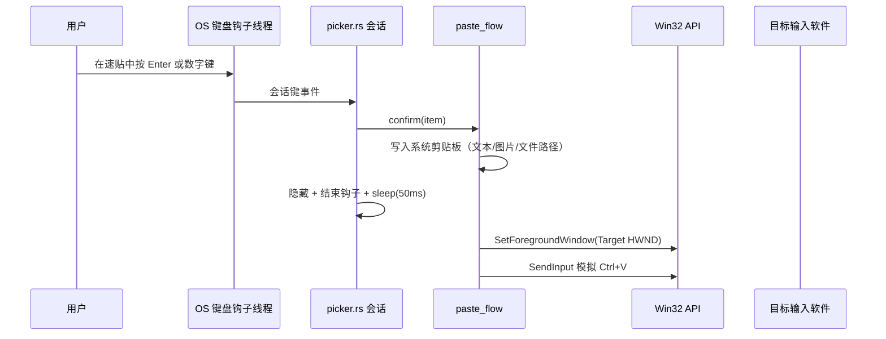

# 无焦点速贴窗口架构与防坑指南

> 活文档：记录速贴无焦点窗口的现行架构与踩坑结论，随实现更新。改窗口生命周期/焦点策略前必读（含 [ADR-0002](adr-0002-picker-docked-mode.md) 停靠形态的实施）。

## 1. 架构概述

速贴窗口（Picker）在用户按下全局快捷键（默认 `Alt+Q`）时瞬间呼出，并且**尽量不抢占当前正在工作的目标软件（如 Word、代码编辑器）的输入焦点**。用户在速贴中可以使用会话快捷键（`Up / Down / Enter / Escape / 1-9`）、双击条目，或直接点击窗口外部结束本次速贴会话。速贴支持文本、图片和文件条目的展示与上屏，图片条目支持悬浮大图预览和 Shift+Enter 按文件路径上屏。

当前实现（Slint 原生壳）的关键链路：

1. **五窗启动即建**：`main.rs` 启动即创建全部窗口（速贴/搜索/编辑/设置/悬浮气泡）。速贴/搜索/悬浮气泡平时屏外停屏、按需上屏（`overlay.rs`），winit 窗口常驻；编辑/设置窗隐藏即销毁回收帧缓冲、重开两段式重建。避免动态建窗的时序坑（见坑一、坑八）。
2. **智能定位策略**：根据设置优先贴近鼠标、上次关闭位置或目标窗口插入符位置，并在超出工作区时自动回收至可见区域。
3. **Win32 无焦点显示**：通过 `WS_EX_NOACTIVATE` 与无激活上屏避免抢占焦点，并在必要时立即恢复目标窗口。
4. **会话期键盘接管**：速贴显示期间由低级键盘钩子（LL）接管会话按键，主快捷键与会话控制互不冲突，方向键支持长按连发。
5. **会话退出兜底**：低级鼠标钩子监听窗口外点击自动关闭，Esc 或再按主快捷键关闭并归还焦点；搜索窗口经独立热键或托盘菜单唤起。
6. **悬浮气泡**：独立轻量窗口显示条目预览（图片大图或文本摘要），跟随鼠标位置并自适应屏幕边缘定位，点击穿透。

---

## 2. 核心实现逻辑与时序图

### 2.1 呼出速贴窗口（Show Picker）

1. **记录当前活动窗口**：在显示速贴前，通过 `GetForegroundWindow` 记录目标窗口句柄（HWND）。
2. **解析显示位置**：按 `pickerPositionMode` 计算窗口左上角；`caret` 模式优先读取目标线程插入符位置，失败回退鼠标位置，`lastPosition` 模式复用上次关闭位置。
3. **无焦点上屏**：窗口保持 `WS_EX_NOACTIVATE` 扩展样式，从屏外停屏位移动到目标位置上屏（不走会抢焦点的 `ShowWindow` 路径）。
4. **保险式恢复焦点**：若存在目标窗口句柄，显示后立即尝试一次 `SetForegroundWindow(HWND)` 把焦点拉回原目标窗口。
5. **接管会话键盘**：`session_keyboard.rs` 的 LL 钩子开始转发 `Up / Down / Enter / Escape / Digit1..9`；按住方向键进入后台重复发射导航事件。
6. **启动鼠标外点监控**：`mouse_monitor.rs` 注册 `WH_MOUSE_LL` 低级鼠标钩子，检测用户是否点在速贴外部。
7. **必要时隐藏搜索窗**：显示速贴时若搜索窗可见则一并隐藏（`search::hide`），只保留速贴为当前可见主界面。

### 2.2 确认上屏与关闭窗口（Hide & Paste）

1. **卸载会话能力**：取消会话键盘接管，关闭鼠标钩子。
2. **持久化当前位置**：窗口几何仍可读取时保存当前左上角坐标，供 `lastPosition` 模式下次复用。
3. **隐藏速贴**：屏外停屏。
4. **延迟恢复目标**：休眠 `50ms` 待隐藏稳定后，按会话来源恢复目标应用或重新打开搜索窗。
5. **模拟粘贴**（`paste_flow.rs` / `paste_support.rs`）：
   - 文本条目：写入文本到系统剪贴板，`SendInput` 模拟 `Ctrl+V`。
   - 图片条目（Enter）：写入图片数据到剪贴板，模拟 `Ctrl+V`。
   - 图片条目（Shift+Enter）：将图片文件路径写入剪贴板，模拟 `Ctrl+V`（上屏为文件路径）。

### 2.3 窗口壳层与装配（现行）

- `main.rs` 负责启动顺序与模块间接线；各窗口模块（`picker.rs`、`search.rs`、`editor.rs`、`settings.rs`）自带 `wire()` 绑定回调，界面在 `ui/*.slint`。
- 界面事件（点击、悬停、输入）经 Slint 回调进入 Rust 会话模块，会话模块再调用 core 服务；反向状态通过各窗口的属性/模型更新。
- 悬浮气泡是独立轻量透明窗（`tooltip.rs` + `ui/tooltip.slint`），`WS_EX_LAYERED | WS_EX_TRANSPARENT` 实现点击穿透，不参与焦点管理。

---

## 3. 踩坑记录与解决方案（Troubleshooting）

### 坑一：动态建窗叠加 Win32 干涉，容易渲染异常

- **现象**：动态创建窗口后立即修改无焦点样式/位置，内容区渲染异常（Tauri 时期表现为 WebView2 白屏或只剩边框；winit 下表现为首帧闪烁、边框暖屏）。
- **原因**：窗口创建、渲染首帧、Win32 样式修改都堆叠在冷启动阶段，打断渲染器初始化时序。
- **解决方案**：速贴/搜索/悬浮气泡启动即建，显隐走屏外停屏与位置切换（`overlay.rs`），不调用会触发销毁的 `hide()`；编辑/设置窗启动即建、隐藏即销毁并两段式重建；动态建窗只保留为异常兜底路径。

### 坑二：热键回调线程里做重活，容易死锁或丢键

- **现象**（历史）：在快捷键回调内立即注销热键/操作窗口，第二次唤起或关闭时卡死（Tauri global-shortcut 插件持注册表锁与主线程互等）；钩子线程做耗时事会被系统摘钩或吞按键。
- **解决方案**：热键与钩子回调只做"转发"——回调线程尽快返回，窗口与会话操作回主线程执行（`hotkey.rs` 独立线程收 `RegisterHotKey` 消息）。

### 坑三：隐藏窗口后立即恢复焦点，容易触发窗口竞态

- **现象**：关闭速贴后偶发目标窗口没有恢复到最前，或下一个窗口没有稳定拿到焦点；外击关闭时还原前台会导致目标任务栏图标闪烁。
- **原因**：`hide`、上屏动画、`SetForegroundWindow`、`show` 挤在同一帧时，窗口管理器状态竞争。
- **解决方案**：隐藏后统一走后台线程 `sleep(50ms)` 再恢复/打开；**外击关闭路径不还原前台**（焦点本就在目标窗口，还原反而闪烁），Esc/快捷键/确认上屏路径仍归还焦点。

### 坑四：无焦点窗口不会天然感知"点击窗口外部"

- **现象**：速贴不抢焦点后，应用内收不到可靠的失焦/点击事件。
- **原因**：窗口级事件只覆盖自身客户区，无法覆盖整个桌面坐标系，也无法判断点击落在别的应用窗口上。
- **解决方案**：`mouse_monitor.rs` 用 `WH_MOUSE_LL` 捕获鼠标按下，结合 `GetWindowRect` 判断点击点是否在速贴边界外；落在外部则异步关闭。

### 坑五：多窗口切换的清理逻辑分散，容易顺序不一致

- **现象**：窗口切换或关闭返回时，偶发会话键盘未释放、鼠标钩子未关闭、目标窗口恢复时序错乱。
- **原因**：清理逻辑分散在不同回调点，容易遗漏共享状态收口。
- **解决方案**：窗口切换与关闭返回统一由 Rust 侧一处收口，固定顺序「结束键盘接管 → 停止鼠标监控 → 隐藏 → 延迟恢复/打开目标窗」；速贴确认上屏的收尾与编辑器关闭返回来源窗口都走这一模式。

### 坑六：插入符定位不是所有应用都稳定可读

- **现象**：在部分浏览器、管理员权限窗口或自绘输入框中，速贴无法稳定贴到文本光标附近。
- **原因**：`GetGUIThreadInfo` 只在目标线程暴露可用插入符时返回有效坐标；部分应用不公开该信息，或前台线程已切换。
- **解决方案**：`caret` 模式优先读插入符，失败自动回退鼠标位置；需要稳定位置可改用 `mouse` 或 `lastPosition` 模式。

### 坑七：透明窗口圆角穿帮（背景遮挡与外阴影裁切）

- **现象**：透明无框窗口四周出现直角尖角，与圆角卡片冲突。
- **原因**：两类问题叠加——① 窗口背景未完全透明，实色填掉了圆角外的区域；② 外阴影超出窗口边界被系统裁切，四角最明显。
- **关键结论**：圆角"变尖"不一定是圆角失效，先区分"背景遮挡"还是"外阴影裁切"。
- **现行方案**：窗口设为全透明，卡片圆角与描边由 Slint 自绘内收；投影用 `DwmExtendFrameIntoClientArea` 底部 1px 造系统投影（`win32_ext.rs`），不依赖超出窗界的外阴影。
- **快速排查**：临时去掉阴影类样式，尖角立即消失即为外阴影裁切；再交叉核对窗口透明与背景色设置。

### 坑八：winit 置顶与窗口生命周期耦合（近期最重要）

- **现象**：① 置顶位有两类失效——winit 异步样式重排/系统操作把 `WS_EX_TOPMOST` 剥掉，或另一个置顶窗口在速贴之后抬升（topmost 带内后来者在上有权盖住速贴）；惰性建窗时期还出现过搜索窗缺席（销毁而非隐藏）连带剥掉速贴置顶且简单重抬不可靠，这是该改造整体回退的原因之一。② 编辑/设置窗启用 `SLINT_DESTROY_WINDOW_ON_HIDE`（关闭即回收帧缓冲）后，重开必须走两段式收尾（延迟恢复边框/暖屏/前台，约 50ms），否则样式异常。
- **现行兜底**：会话期置顶守护（`picker.rs` 的 `TOPMOST_GUARD`）——速贴激活期间每 500ms 检查置顶位，失效即重抬，会话结束停表，仅在事件循环线程触达。
- **原因**：winit 对置顶/激活状态的管理与窗口存活及异步样式重排耦合；窗口销毁会连带撤销关联状态，销毁重建则丢失首建时建立的 Win32 修饰。
- **教训**：「编辑/设置窗惰性首建」的改造曾整体回退，现行五窗启动即建：速贴/搜索/悬浮气泡 winit 窗口常驻（显隐不调 `hide()`），编辑/设置窗以「关闭即销毁」控制常驻成本。
- **对停靠面板的约束**：任何新增常驻窗口形态（见 [ADR-0002](adr-0002-picker-docked-mode.md)）都先在本坑结论上做 spike，验证不回退内存优化成果。
