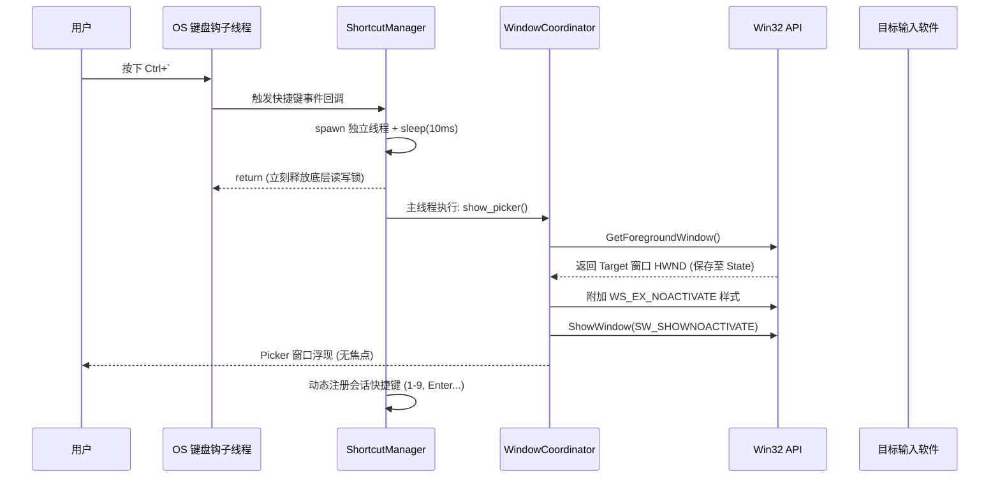
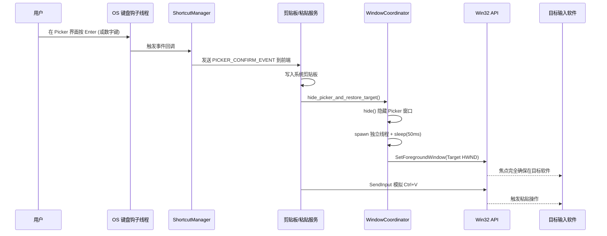

# 无焦点速贴窗口架构与防坑指南

## 1. 架构概述

FloatPaste 的“速贴窗口”（Picker）需要在用户按下全局快捷键（如 `` Ctrl+` ``）时瞬间呼出，并且**不能抢占当前正在工作的目标软件（如 Word、代码编辑器）的输入焦点**。用户在 Picker 中使用快捷键（`1-9`, `Enter` 等）或双击鼠标选择资料后，Picker 自动隐藏，并将资料通过系统模拟按键（`Ctrl+V`）粘贴到原目标窗口。

为了实现这一目标，我们在 Tauri / Rust 后端与 Windows API 层进行了深度集成，主要涉及三个核心链路：
1. **窗口生命周期管理**：后台静默预创建，避免冷启动。
2. **Win32 无焦点显示**：通过 `WS_EX_NOACTIVATE` 拦截焦点抢占。
3. **全局快捷键调度**：解决底层 Hook 线程与主线程的死锁问题。

---

## 2. 核心实现逻辑与时序图

### 2.1 呼出速贴窗口 (Show Picker)

1. **记录当前活动窗口**：在显示 Picker 之前，调用 `GetForegroundWindow` 记录下当前的焦点窗口句柄（HWND）。
2. **无焦点显示 (No-Activate)**：调用 Windows 原生 API 给 Picker 窗口打上 `WS_EX_NOACTIVATE` 扩展样式，调用 `ShowWindow(SW_SHOWNOACTIVATE)` 显示窗口，确保当前目标窗口依然保持激活状态。
3. **注册会话快捷键**：动态注册 Picker 专用的全局快捷键（`Up/Down`, `1-9`, `Enter`, `Escape`），接管用户的键盘输入以进行上下导航和选择。

### 2.2 确认粘贴与隐藏窗口 (Hide & Paste)

1. **卸载会话快捷键**：取消注册 `1-9`, `Enter` 等，将按键控制权交还给系统。
2. **隐藏 Picker**：调用 Tauri API 隐藏窗口。
3. **延迟恢复目标窗口**：休眠 `50ms` 等待 WebView2 彻底清理并隐藏界面，随后调用 `SetForegroundWindow(HWND)` 确保目标窗口位于最前。
4. **模拟粘贴**：利用 `SendInput` 模拟键盘按下和抬起 `Ctrl` 和 `V`。

---

## 3. 踩坑记录与解决方案 (Troubleshooting)

在开发此功能时，遇到了若干 Windows 与 Tauri/WebView2 底层运行时的时序冲突与死锁问题，以下是详细的故障还原与对应的解法：

### 🚨 坑位一：WebView2 渲染管线冷启动卡死（只有边框白屏）
* **现象**：按 `` Ctrl+` `` 动态创建 `WebviewWindowBuilder::new(...)` 并立即施加 `WS_EX_NOACTIVATE`，窗口无法正常加载内部的 React 页面内容，只显示一个透明/白色的外边框，并且进程僵死。
* **原因**：极其密集的底层 Win32 API 窗口状态干预（修改样式、强行取消激活）打断了 WebView2 初始化其内部 GPU 渲染管线的冷启动过程。
* **解决方案**：**后台静默预创建**。在 `tauri.conf.json` 的 `windows` 列表中将 `picker` 预先配置好，设为 `visible: false`。在应用启动时 Tauri 会在后台安静地将整个 React 页面加载并渲染完毕。需要显示时，只需改变可见性，完美绕过冷启动渲染冲突。

### 🚨 坑位二：全局快捷键 Hook 线程重入死锁 (Hook Thread Deadlock)
* **现象**：按 `` Ctrl+` `` 正常弹出 Picker；但第二次按 `` Ctrl+` ``（或按 `Esc` 等会话快捷键）试图关闭 Picker 时，窗口没有消失，随后整个应用完全卡死，无响应。
* **原因**：
  1. Tauri `global-shortcut` 插件在底层使用 OS 级别的键盘钩子消息循环处理事件，触发回调时**持有底层注册表的读写锁**。
  2. 我们在回调函数中，试图调用 `app.run_on_main_thread` 并在主线程立刻执行 `unregister_all()` 来注销快捷键。
  3. 主线程需要获取底层注册表的“写锁”来注销快捷键，但“读锁”还在当前尚未 `return` 的钩子回调函数手里。两者互相等待，导致经典死锁。
* **解决方案**：**异步剥离与微小休眠**。在拦截到快捷键时，立刻 `std::thread::spawn` 开启一条轻量独立线程，并执行 `sleep(10ms)`。这样原来的钩子回调函数得以**立刻 `return`** 并释放读写锁。10 毫秒后，独立线程再将注销快捷键和隐藏窗口的操作抛给主线程 `run_on_main_thread` 安全执行。

### 🚨 坑位三：焦点恢复与窗口隐藏的竞态条件 (Race Condition)
* **现象**：按快捷键关闭 Picker 恢复 Manager 窗口时，偶尔会出现系统焦点丢失，或者 Manager 窗口没有正常置顶响应的问题。
* **原因**：在同一个主线程 Tick 帧中，连续调用 `picker.hide()` 和 `manager.show()` 或 `SetForegroundWindow()`。因为 Windows 的窗口隐藏动画和内部 COM 对象的销毁需要时间，强行在同一瞬间剥夺并转移焦点，会让 Windows 窗口管理器陷入状态混乱。
* **解决方案**：**延迟恢复 (Delayed Restoration)**。在调用 `picker.hide()` 后，放入一个后台线程 `sleep(50ms)`，给 WebView2 和 OS 足够的缓冲时间去清空并隐藏旧窗口，然后再调用 `SetForegroundWindow()` 将焦点稳稳地交给目标应用程序。